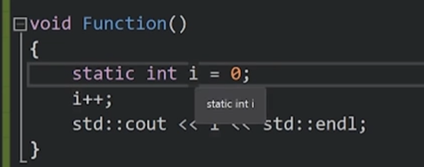

link负责将不同的obj文件连接起来并且得到一个exe文件来运行

## 编译器
编译器用于编译代码生成obj文件
首先会处理预处理的代码
将代码转换成中间语言。
文件无意义，我们分文件只是为了自己的阅读和处理
对于编译器来说他只会根据特定规则去转换代码

## 链接器
将所有obj文件连接成一个exe文件

## 指针
指针主要用于操控和寻找内存
一个指针只是一个地址，它与类型无关，他只是保存了位置

## C++ Class和Struct区别
实际上没有区别
只是默认情况下 Class默认为private
struct默认为public

## 静态变量
如果是类外部 的变量或者函数static，表示它旨在自己的编译单元里起作用，外部无法查找和使用

在类和结构体中
在C#中则表示它只有一个该实例，如果其他地方修改了静态变量，其他地方也会改变，C++也是如此

### 局部静态

局部静态函数能够让其全局存在，但是只有局部能够使用