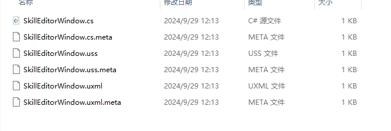

# 头部菜单
1. 技能编辑器的总体布局
2. 头部菜单的布局
3. 头部菜单的功能与交互

整体基于UIToolkit来实现

## 头部菜单布局
1. 新建编辑器专用场景
2. 创建编辑器窗口
3. 制作编辑器整体布局
4. 制作头部菜单具体功能布局


创建EditorWindow
则有三个文件一个脚本文件，一个Uss，一个uxml
类似于制作web页面
uxm类似与xml的一种编辑手法。
编辑时Shift+空格可以全屏，好用

```cs
public class SkillEditorWindow : EditorWindow
{
    [MenuItem("SkillEditor/SkillEditorWindow")]
    public static void ShowSkillEditorWindow()
    {
        SkillEditorWindow wnd = GetWindow<SkillEditorWindow>();
        wnd.titleContent = new GUIContent("技能编辑器");
    }

    public void CreateGUI()
    {
        VisualElement root = rootVisualElement;
        var visualTree = AssetDatabase.LoadAssetAtPath<VisualTreeAsset>("Assets/SkillEditor/Editor/EditorWindow/SkillEditorWindow.uxml");
        VisualElement labelFromUXML = visualTree.Instantiate();
        root.Add(labelFromUXML);
    }
}
```
采用一个树状结构，从rootVisualElement出发，可以自己代码写，也可以在SkillEditorWindow.uxml中编辑后加载资源将整个都导入窗口

## 头部菜单按钮交互
1. 加载战斗编辑器场景
2. 回归旧场景
3. 查看技能基本信息

编辑器加载场景需要使用
```cs
EditorSceneManager.OpenScene(skillEditorScenePath);
```
所以需要场景完整路径

```cs
/// <summary>
/// 查看技能基本信息 
/// </summary>
private void SkillBasicBtnClick()
{
    if (skillConfig != null)
    {
        Selection.activeObject = skillConfig;
    }
}
```