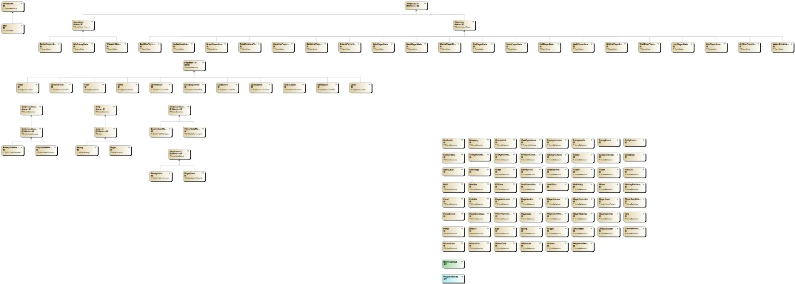
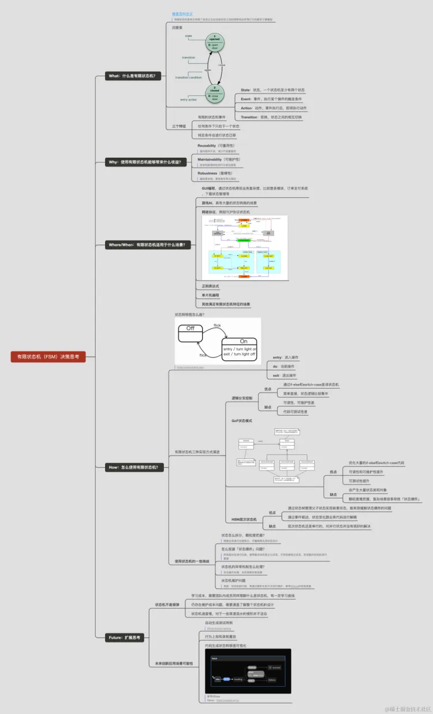

# 类奥德赛
## 项目概述
项目类图如下

整体项目核心是维护一个有限状态机，玩家每个时刻只可能处于一个状态。
**这个游戏的核心就是通过合理的架构维护状态机，然后修正玩家的状态，其中最主要的就是垂直和水平两个速度，∈各种手感都是维护这两个变量而呈现出来的。**

主要包含了以知识点


## 使用inputSystem
创建一个inputsystem，为想要操控的人物添加脚本，脚本需要声明InputActionAsset类型的组件，并将创建的资源拖到上面。然后在代码中使用InputAction类型将对应的Actions取出来如：
```C#
InputAction m_movement = actions["Movement"];
```
详细可看文件夹中PlayerInputManager脚本

## 状态机

### Entity
他是一个抽象类，被敌人和玩家继承，主要处理角色之间都有的行为，比如移动和碰撞，还有一些基础属性和方法。
### EntityEvents
这个类主要定义会被Entity组件触发的事件。基础有这几个
```C#
public UnityEvent OnGroundEnter;
public UnityEvent OnGroundExit;
public UnityEvent OnRailsEnter;
public UnityEvent OnRailsExit;
等等
```
### EntityHitbox
挂在人物身上的，主要是对他人造成伤害或破坏，还允许实体通过反弹来施加伤害以对命中事件做出反应；施加一些力是游戏操作更加丝滑真实。
### EntityState
所有状态的基类。主要是PlayerState和EnemyState继承的，然后搭配相关的StateManager使用，可以实现更多复杂的状态，以下代码强调子类必须实现这几个接口。
```C#
protected abstract void OnEnter(T entity);
protected abstract void OnExit(T entity);
protected abstract void OnStep(T entity);
public abstract void OnContact(T entity, Collider other);
```
### EntityStateManager
跟上面是搭配使用的，主要是管理状态的，然后可以切换。动画状态机基本就是这个的可视化，这样理解更加直观一些。
### EntityStateManagerEvents
核心就这三个事件
```C#
public UnityEvent onChange;
public UnityEvent<Type> onEnter;
public UnityEvent<Type> onExit;
```
### EntityStateManagerListener
维护一个states状态组，当状态进入或者退出的时候，你关心的这个states就可以做一些操作了，这个用在了人物攻击的时候。
```C#
protected virtual void OnEnter(Type state)
{
    if (states.Contains(state.Name))
    {
        onEnter.Invoke();
    }
}
```
### EntityStats
是一个Scriptable脚本记录了所有的状态值，好处是完全可以开放给策划配置，或者说搞一个excel读进来，不过这不是本例子的实现方式。
### EntityStatsManager
搭配上面使用的
### EntityVolumeEffector
主要是后期的泥浆Mud用这个，可以很好的处理玩家的缓动速度
```C#
protected virtual void OnTriggerEnter(Collider other)
{
    if (other.TryGetComponent(out Entity entity))
    {
        entity.velocity *= velocityConversion;
        entity.accelerationMultiplier = accelerationMultiplier;
        entity.topSpeedMultiplier = topSpeedMultiplier;
        entity.decelerationMultiplier = decelerationMultiplier;
        entity.turningDragMultiplier = turningDragMultiplier;
        entity.gravityMultiplier = gravityMultiplier;
    }
}
```

## 制作过程中的一些笔记
### 搭建一个状态机
想要做好也是比较困难的。首先要还是需要一个StateMachine来控制状态之间的转换，还有许多的State类，表示角色的状态，最后需要一个Player脚本来挂载在玩家对象上。
### 获取相机朝向
首先获取当前移动的朝向,然后获得摄像机的朝向，然后将方向转向摄像机朝向然后归一化
```csharp
if (direction.sqrMagnitude > 0)
{
	var rotation = Quaternion.AngleAxis(m_camera.transform.eulerAngles.y, Vector3.up);
	direction = rotation * direction;
	direction = direction.normalized;
}
```
###  人物移动算法
```csharp
先计算移动方向和当前摄像机朝向夹角
var dot = Vector3.Dot(inputDirection, player.lateralVelocity);
if (dot >= player.stats.current.brakeThreshold)
{
    //像输入方向平滑移动
	player.Accelerate(inputDirection);
    //将人物朝向逐渐转向输入方向
	player.FaceDirectionSmooth(player.lateralVelocity);
}
else
{
	player.states.Change<BrakePlayerState>();
}
```
平滑移动
```csharp
public virtual void Accelerate(Vector3 direction)
{
	var turningDrag = isGrounded && inputs.GetRun() ? stats.current.runningTurningDrag : stats.current.turningDrag;
	var acceleration = isGrounded && inputs.GetRun() ? stats.current.runningAcceleration : stats.current.acceleration;
	var finalAcceleration = isGrounded ? acceleration : stats.current.airAcceleration;
	var topSpeed = inputs.GetRun() ? stats.current.runningTopSpeed : stats.current.topSpeed;

	Accelerate(direction, turningDrag, finalAcceleration, topSpeed);

	if (inputs.GetRunUp())
	{
		lateralVelocity = Vector3.ClampMagnitude(lateralVelocity, topSpeed);
	}
}

/// <summary>
/// Moves the Player smoothly in a given direction.
/// </summary>
/// <param name="direction">The direction you want to move.</param>
/// <param name="turningDrag">How fast it will turn towards the new direction.</param>
/// <param name="acceleration">How fast it will move over time.</param>
/// <param name="topSpeed">The max movement magnitude.</param>
public virtual void Accelerate(Vector3 direction, float turningDrag, float acceleration, float topSpeed)
{
	if (direction.sqrMagnitude > 0)
	{
		var speed = Vector3.Dot(direction, lateralVelocity);
		var velocity = direction * speed;
		var turningVelocity = lateralVelocity - velocity;
		var turningDelta = turningDrag * turningDragMultiplier * Time.deltaTime;
		var targetTopSpeed = topSpeed * topSpeedMultiplier;

		if (lateralVelocity.magnitude < targetTopSpeed || speed < 0)
		{
			speed += acceleration * accelerationMultiplier * Time.deltaTime;
			speed = Mathf.Clamp(speed, -targetTopSpeed, targetTopSpeed);
		}

		velocity = direction * speed;
		turningVelocity = Vector3.MoveTowards(turningVelocity, Vector3.zero, turningDelta);
		lateralVelocity = velocity + turningVelocity;
	}
}
```

### 人物动画
将动画参数的名称转换为hash值，这样就可以在动画中存储上一个状态动画，角色的动画都在PlayerAnimator脚本中切换

### 人物手感优化
添加多个状态，如制动状态，转身状态等。

### 增加下落功能
对y轴持续施加一个向下的速度就可以，如果检测到地面就停止下落。如果脱离地面，那就会执行ExitGround事件，会记录最后一次离开地面的时间。 这些事件最好另外创建一个脚本存储。 

### 跳跃
土狼时间:即使冲出平台也能在一段时间内跳跃。
超级跳:设定两个值，即最小跳跃高度和最大跳跃高度，
还要记录按下和松开跳跃键时间。这样就可以记录键盘按下的时间了，
还能够通过松开跳跃键时的速度来比较当前所在高度从而来判断是否时超级跳。 

### 摄像机移动跟随
使用Cinemachine。PostProcessing。
主相机挂在Cinemachine主要的东西，然后使用一个PlayerCamera。使用CinemachineCollider来在与物体碰撞时会剔除。
将摄像机跟随的对象设置为player。

### 金币跳动
使用字符串时可以用一个脚本管理所有的字符串变量，这样直接使用变量防止拼错
