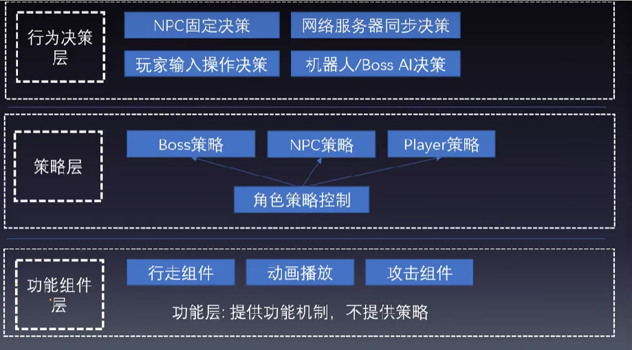

## 项目需求
技能可拓展，
区域攻击技能：对整个攻击都有效
Buff：技能有效时间，技能对攻击的buff叠加。buff FreezeTime。
### 从配置表的角度
#### 技能需求：  
1. 技能会有很多分类，
   Skill ---> A类，B类，C类
   每一种技能，都是一个计算模板，每类技能中，可能有某个非常特殊的技能，要单独对某个方面做独立计算。
   **整个技能系统设计后，只提供机制来拓展，拓展技能非常方便，拓展后其他代码不用改，能直接使用那一类技能。**
2. 技能中，可能要执行很多不同流程和事件
    提供机制，能非常方便的添加流程
    技能：伤害计算
    技能：触发一个子技能
    技能：给自己一个反作用力
#### Buff需求
1. 我们技能的持续时间与冷却时间管理
2. 角色同时可能有多个Buff作用，不用改代码，直接用通用模板，来解决多个Buff迭代的问题。
3. 要针对Buff来加不同的属性：Attack，Defense，搜索半径，加速。

### 分析假定技能与Buff的配置表
excel有ID，技能名，技能介绍，技能动画，图标icon，技能特效，技能半径，技能持续时间，技能时间戳，最大目标数，固定伤害值
技能时间戳，定义了整个技能持续时间内的各种时间节点，默认有开始时间，结束事件等也可以自己添加。
每一类技能完全不一样，可以是完全不一样的配置表，但是这类技能里面的每个技能和Buff都是通用的技能模板。

改变的是模板的具体逻辑
不变的是整个技能驱动与Buff驱动的机制，机制与数据分离(配置表+模板具体处理逻辑)

## 如何与策划沟通：做好技能与Buff配置表
### 理念
**无论制作什么样子的模块，都需要做需求分析**
任何设计不能脱离需求，做设计并不是越复杂或越简单越好，而是越真实越好，越真实的解决问题。任何代码都要有可以丢弃的心态。
不要为了追求所谓的可重用性而做过多的，过度的设计。
### 实现
1. 一定要做好需求分析调查清除游戏玩法所涉及的技能和需求。
2. 这就需要和策划进行梳理和分类
   1. 有哪些类型的技能
   2. 有哪些类型的Buff
   3. 在什么情况下会操作技能与Buff
   4. 技能的释放的条件，Buff的条件，时间限制，红蓝，药水限制

    能用同一个模板处理的技能或Buff，归为一类 ---> 一个Model,一个模板
    每类技能：ModelA ， ModelB，Buff也类似
    每一类根据它的计算逻辑 -》 得到配置表的每个字段，需求分析得到。每一个类一个表
    这样策划就知道怎么填了，就可以做编辑工作。 然后，再开发对应的Buff与技能。
    使用策划的数据+模板计算策略。 ---》 架构；
    如果涉及到简单的流程，逻辑编辑，这个时候，还要规避一些方式。如时间戳使用|符号来分割如Init|0|end|0.7，这样来填写。
3. 解决策划编辑时的复杂度问题
   有需求才制作
   如果编辑一些数值太费力，如总时间可能与动画绑定----》 制作一个可视化编辑器，把每个技能的数据+Unity编辑器里面，集合图形动画，设置好，直接导出来。
4. 动手写执行代码
   变：每类技能 或 Buff 的计算模板  -----》单独提取出来，可拓展
   不变： 整个使用这些的流程  -----》 通用的，不需要修改，一次写好 
不要脱离需求的太灵活，影响代码的复杂度和稳定性。 -----》 反映了整个需求的代码是最好维护的。
### 注意
设计表格格式：
1. 策划使用方便
2. 自己方便解析

## 基础模块支撑
制作技能Buff系统需要引入定时器，事件通知，资源管理等，excel表格等。

## 基于三层架构制作角色战斗设计
战斗单元的三重设计

### 行为操作决策层
不直接调用战斗里面的策略----》通过发送事件，统一处理；
主要处理各种战斗单元的操作事件：玩家输入操作(UI操作，游戏手柄)
NPC/机器人/Boss AI决策操作
网络玩家的输入操作(Net操作)

要调用不同的策略来进行处理
UI操作；
游戏手柄操作；
键盘操作；发起某个技能的攻击
### 策略层
由战斗管理器
FightMgr.ProcessEvent(操作，哪个玩家){
   找到对应的玩家；
   玩家.处理策略,发一个技能。
}

GM_Character ---> 通用的战斗单元
Boss，NPC，Player
### 功能组件层
需要功能组件来完成具体功能，技能，Buff，玩家数据，动画切换，行走移动......
**策略层要做什么，就交给功能组件来具体处理**

### 制作思路
所有struct放在Constant里。
功能层用结构体定义 --> 对象的实例的内存布局基本就在一块

## 技能架构与设计
定义某个技能要处理那些时刻，做哪些事情---》model+配置
每次释放技能，从配置里把这个执行点，放入到时间轴中。
根据时间进度，一次的来处理对应的这些执行点。

StartSkill(skillID)
根据skillID，从SkillMgr里获取执行的执行点
将这些执行点放入到技能的TimeLine里执行
根据时间，来执行每个执行点。

### 类的扫描
Attribute机制