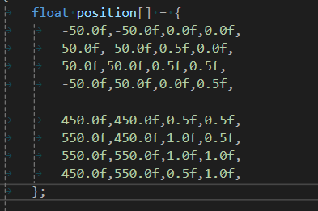

## 批量渲染
可以做批处理，将所有贴图塞到一个顶点缓冲区中。
所以就出现了材质，其实材质就是一个Shader然后加上一大堆的
统一变量
在Unity中如果要合批，那么就需要材质完全相同，就是这个原因

## 一个基本的纹理渲染

```cpp
#include "TestTexture2D.h"

#include "Renderer.h"
#include "imgui/imgui.h"

#include "glm/glm.hpp"
#include "glm/gtc/matrix_transform.hpp"

namespace test
{
	TestTexture2D::TestTexture2D()
		:m_TranslationA(200, 200, 0), m_TranslationB(400, 400, 0)
		,m_Proj(glm::ortho(0.0f, 1920.0f, 0.0f, 1080.0f, -1.0f, 1.0f))
		,m_View(glm::translate(glm::mat4(1.0f), glm::vec3(0, 0, 0)))
	{
		float position[] = {
			-50.0f,-50.0f,0.0f,0.0f,
			50.0f,-50.0f,1.0f,0.0f,
			50.0f,50.0f,1.0f,1.0f,
			-50.0f,50.0f,0.0f,1.0f,
		};

		unsigned int indices[] = {
			0,1,2,
			2,3,0,
		};

		GLCall(glEnable(GL_BLEND));
		GLCall(glBlendFunc(GL_SRC_ALPHA, GL_ONE_MINUS_SRC_ALPHA));

		m_VBO = std::make_unique<VertexBuffer>(position, sizeof(position));
		VertexBufferLayout layout;
		layout.Push<float>(2);
		layout.Push<float>(2);

		m_VAO = std::make_unique<VertexArray>();
		m_VAO->AddBuffer(*m_VBO, layout);

		m_IBO = std::make_unique<IndexBuffer>(indices, 6);

		m_Shader = std::make_unique<Shader>("res/shader/Basic.shader");
		m_Shader->Bind();
		m_Shader->SetUniform4f("u_Color", 0.8f, 0.3f, 0.8f, 1.0f);
		m_Texture = std::make_unique<Texture>("res/textures/44.png");
		m_Shader->SetUniform1i("u_Texture", 0);

	}
	TestTexture2D::~TestTexture2D()
	{
	}
	void TestTexture2D::OnUpdate(float deltaTime)
	{
	}
	void TestTexture2D::OnRender()
	{
		GLCall(glClearColor(0.0f, 0.0f, 0.0f, 1.0f));
		GLCall(glClear(GL_COLOR_BUFFER_BIT));
		Renderer renderer;

		m_Texture->Bind();

		{
			glm::mat4 model = glm::translate(glm::mat4(1.0f), m_TranslationA);
			glm::mat4 mvp = m_Proj * m_View * model;
			m_Shader->Bind();
			m_Shader->setuniformMat4f("u_MVP", mvp);
			renderer.Draw(*m_VAO, *m_IBO, *m_Shader);
		}
		{
			glm::mat4 model = glm::translate(glm::mat4(1.0f), m_TranslationB);
			glm::mat4 mvp = m_Proj * m_View * model;
			m_Shader->Bind();
			m_Shader->setuniformMat4f("u_MVP", mvp);
			renderer.Draw(*m_VAO, *m_IBO, *m_Shader);
		}

	}
	void TestTexture2D::OnImGuiRender()
	{
		ImGui::SliderFloat3("Translation A", &m_TranslationA.x, 0.0f, 1920.0f);
		ImGui::SliderFloat3("Translation B", &m_TranslationB.x, 0.0f, 1920.0f);
		ImGui::Text("Application average %.3f ms/frame (%.1f FPS)", 1000.0f / ImGui::GetIO().Framerate, ImGui::GetIO().Framerate);
	}
}
```

## 批量渲染

将集合图形批处理到一个独立顶点缓冲区和索引缓冲区

绘制一个四边形
需要四个顶点缓冲
六个索引缓冲


## 关于颜色

用顶点位置填充顶点缓冲区，然后渲染那个四边形，然后再片段着色器中传入一个啊包含颜色的统一变量，并且输出。但如果要写两种颜色，那就不行了。
使用顶点颜色来一个DrawCall绘制多种颜色。顶点再渲染中表示一个点，它不止包含位置数据，它可以包含真正想要的所有数据
比如说我们可以在坐标之后再添加一个纹理坐标数据，就会根据这个坐标去采样纹理了


## 关于纹理
可以将多个纹理打成图集，这样就可以通过纹理采样来再一个DrawCall中绘制不同的图形。

GPU大约有32个纹理插槽,所以还有一种方法，就是再顶点中在加一个数据表示对应的采样纹理的插槽

## 动态几何

每帧设置所有这些不同的四边形的位置，动态地将他们组合成一个DrawCall


## 关于索引


## 批量渲染器
