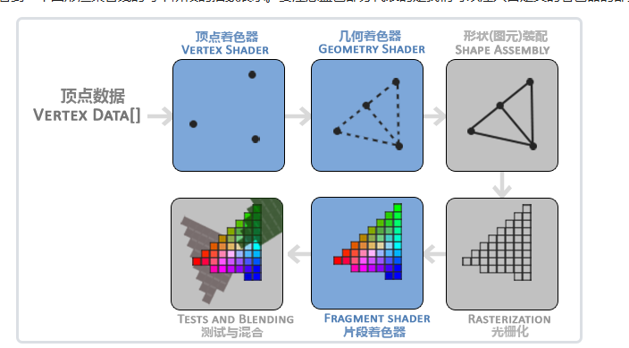

# 概述
OpenGL只是一个规范，而他的实现其实是GPU厂商已经在应建立实现了OpenGL，每个厂商都会有差别。它是开源的，所以我们也看不到OpenGL的源码。所以OpenGL永远不可能开源，他只是一个规范。

## 绘制一个简单三角形
```cpp
    glBegin(GL_TRIANGLES);
    glVertex2d(1.0f,1.0f);
    glVertex2d(0.0f,0.5f);
    glVertex2d(-1.0f, -1.0f);
    glEnd();
```

填写三个顶点就可以绘制一个三角形，
窗口右上角为(1,1)
左下角为(-1,-1)

## 导入OpenGL的库 GLFW，GLEW
主要就是在编译器和连接器导入附加库，将对应文件目录导入到目录中就可以连接

## 顶点缓冲区和绘制三角形

顶点数组对象：Vertex Array Object，VAO
顶点缓冲对象：Vertex Buffer Object，VBO
元素缓冲对象：Element Buffer Object，EBO 或 索引缓冲对象 Index Buffer Object，IBO

顶点缓冲区：
1. 只是一个缓存空间，用来保存内存字节
2. 他只是在GPU中，显存中，然后发送DrawCall来绘制他
3. 创建缓冲区。创建一个新的OpenGL缓冲区对象，并将其绑定为当前的顶点数组缓冲区，以便后续操作（如填充数据、设置顶点属性指针等）可以针对这个缓冲区进行。
4. glBufferData是一个专门用来把用户定义的数据复制到当前绑定缓冲的函数。它的第一个参数是目标缓冲的类型：顶点缓冲对象当前绑定到GL_ARRAY_BUFFER目标上。第二个参数指定传输数据的大小(以字节为单位)；用一个简单的sizeof计算出顶点数据大小就行。第三个参数是我们希望发送的实际数据。

第四个参数指定了我们希望显卡如何管理给定的数据。它有三种形式：

GL_STATIC_DRAW ：数据不会或几乎不会改变。
GL_DYNAMIC_DRAW：数据会被改变很多。
GL_STREAM_DRAW ：数据每次绘制时都会改变。
```cpp
unsigned int buffer;
glGenBuffers(1, &buffer);
glBindBuffer(GL_ARRAY_BUFFER, buffer);
glBufferData(GL_ARRAY_BUFFER, sizeof(positions), positions, GL_STATIC_DRAW);

glVertexAttribPointer(0, 2, GL_FLOAT, GL_FALSE, sizeof(float) * 2, 0);
```
glVertexAttribPointer方法参数：
1. 指定要修改的通用顶点属性的索引。
2. 指定每个通用顶点属性的组件数。必须是 1、2、3、4
3. 指定数组中每个组件的数据类型
4. 指定在访问定点数据值时，是应规范化 （GL_TRUE） 还是直接转换为定点值 （GL_FALSE） 。
5. 指定连续通用顶点属性之间的字节偏移量
6. 指定当前绑定到GL_ARRAY_BUFFER目标的缓冲区的数据存储中数组中第一个泛型顶点属性的第一个组件的偏移量

着色器
1. Shader其实就是运行在显卡上的程序，是一堆可以编写的可以在显卡上运行的代码

OpenGL本质上是一个状态机，我想让你用这些顶点数据，用这个Shader，然后给我绘制个三角形，这就是DrawCall指令



顶点不止包含位置，还可以包含其他的数据(法线，颜色)


## Shader(着色器)
Shader基本上就是一个运行在显卡上的一个程序(代码)
一般程序运行在CPU上。
为显卡编程时我们希望能够使用显卡来绘制图像，能够控制显卡渲染的流程，但不代表渲染全部都在显卡上进行
我们需要告诉显卡如何绘制。

### 顶点着色器
渲染顶点数据(由我们传入的顶点数组)

### 片元着色器
渲染屏幕上的每个像素，它的调用次数一般远远大于顶点着色器，所以做优化的时候需要着重考虑

```cpp
/// <summary>
/// 编译Shader
/// </summary>
/// <param name="type">着色器的类型</param>
/// <param name="source">一个字符串，包含着色器的源代码。</param>
/// <returns></returns>
static unsigned int CompileShader(unsigned int type, const std::string& source)
{
	unsigned int id = glCreateShader(type);
	const char* src = source.c_str();
	glShaderSource(id, 1, &src, nullptr);
	glCompileShader(id);

	int result;
	glGetShaderiv(id, GL_COMPILE_STATUS, &result);
	if (result == GL_FALSE)
	{
		int length;
		glGetShaderiv(id, GL_INFO_LOG_LENGTH, &length);
		char* message = (char*)alloca(length * sizeof(char));
		glGetShaderInfoLog(id, length, &length, message);
		std::cout << "Fail to compile" << (type == GL_VERTEX_SHADER ? "vertex" : "fragment")
			<< "shader!" << std::endl;
		std::cout << message << std::endl;
		glDeleteShader(id);
		return 0;
	}

	return id;
}

/// <summary>
/// 创建Shader
/// </summary>
/// <param name="vertexShader">顶点着色器源码</param>
/// <param name="fragmentShader">片段着色器源码</param>
/// <returns></returns>
static unsigned int CreateShader(const std::string& vertexShader, const std::string& fragmentShader)
{
	unsigned int program = glCreateProgram();
	unsigned int vs = CompileShader(GL_VERTEX_SHADER, vertexShader);
	unsigned int fs = CompileShader(GL_FRAGMENT_SHADER, fragmentShader);

	glAttachShader(program, vs);
	glAttachShader(program, fs);
	glLinkProgram(program);
	glValidateProgram(program);

	glDeleteShader(vs);
	glDeleteShader(fs);

	return program;
}

unsigned int shader = CreateShader(vertexShader,fragmentShader);
glUseProgram(shader);
```
通过文件读取方式写入Shader
```cpp
struct ShaderProgramSource
{
	std::string VertexSource;
	std::string FragmentSource;
};

/// <summary>
/// 导入Shader文件
/// </summary>
/// <param name="filepath"></param>
/// <returns></returns>
static ShaderProgramSource ParseShader(const std::string& filepath)
{
	std::ifstream stream(filepath);

	enum class ShaderType
	{
		NONE = -1, VERTEX = 0, FRAGMENT = 1
	};

	std::string line;
	std::stringstream ss[2];
	ShaderType type = ShaderType::NONE;
	while (getline(stream, line))
	{
		if (line.find("#shader") != std::string::npos)
		{
			if (line.find("vertex") != std::string::npos)
				type = ShaderType::VERTEX;
			else if (line.find("fragment") != std::string::npos)
				type = ShaderType::FRAGMENT;
		}
		else
		{
			ss[(int)type] << line << '\n';
		}
	}

	return { ss[0].str(),ss[1].str() };
}
```

## 索引缓冲区(index buffer)
如果像画一个正方形，我们需要两个三角形
所有图形都由三角形形成
我们绘制三角形需要三个点，那么绘制一个四边形就需要6个点，但是实际上这是没有必要的。
两个三角形组成四边形，他们相交的那条边的两个点是重复的
所以其实只需要四个点就可以了。这个时候就需要索引缓冲区。

```cpp
	unsigned int indices[] = {
		0,1,2,
		2,3,0,
	};
unsigned int ibo;
glGenBuffers(1, &ibo);
glBindBuffer(GL_ELEMENT_ARRAY_BUFFER, ibo);
glBufferData(GL_ELEMENT_ARRAY_BUFFER, sizeof(indices), indices, GL_STATIC_DRAW);
```
此时就不能使用glDrawArrays了
```cpp
//glDrawArrays(GL_TRIANGLES, 0, 6);
glDrawElements(GL_TRIANGLES, 6, GL_UNSIGNED_INT,nullptr);
```
注意一定要是无符号整型GL_UNSIGNED_INT.