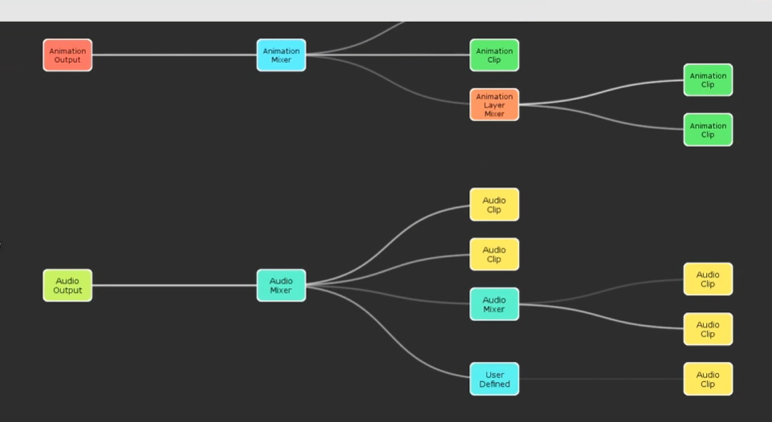
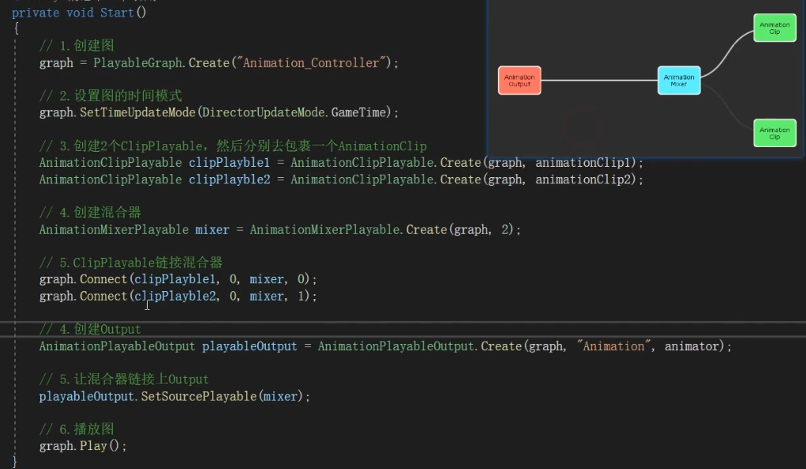

# Playable

按照子节点的一个权重不断往上融合，最后到根节点输出一个融合后的动画

```cs
    public void Init()
    {
        // 创建图
        graph = PlayableGraph.Create("Animation_Controller");
        // 设置图的时间模式
        graph.SetTimeUpdateMode(DirectorUpdateMode.GameTime);
        // 创建混合器
        mixer = AnimationMixerPlayable.Create(graph, 3);
        // 创建Output
        AnimationPlayableOutput playableOutput = AnimationPlayableOutput.Create(graph, "Animation", animator);
        // 让混合器链接上Output
        playableOutput.SetSourcePlayable(mixer);
    }
```

## 动画混合



## RootMotion
视觉表现上更好，能够更好地还原动画的表现
但是需要解决模型不跟角色的问题 