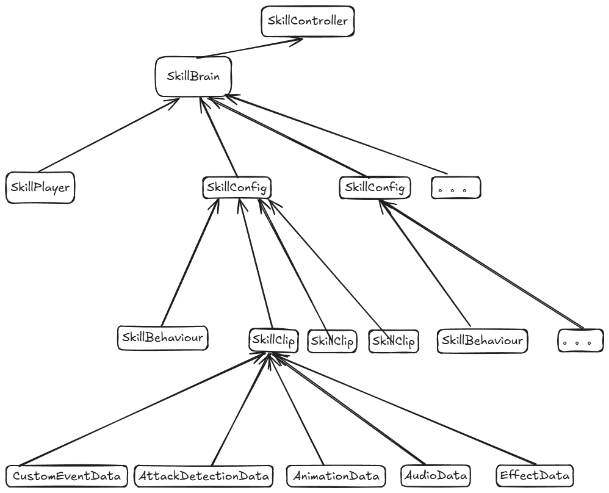
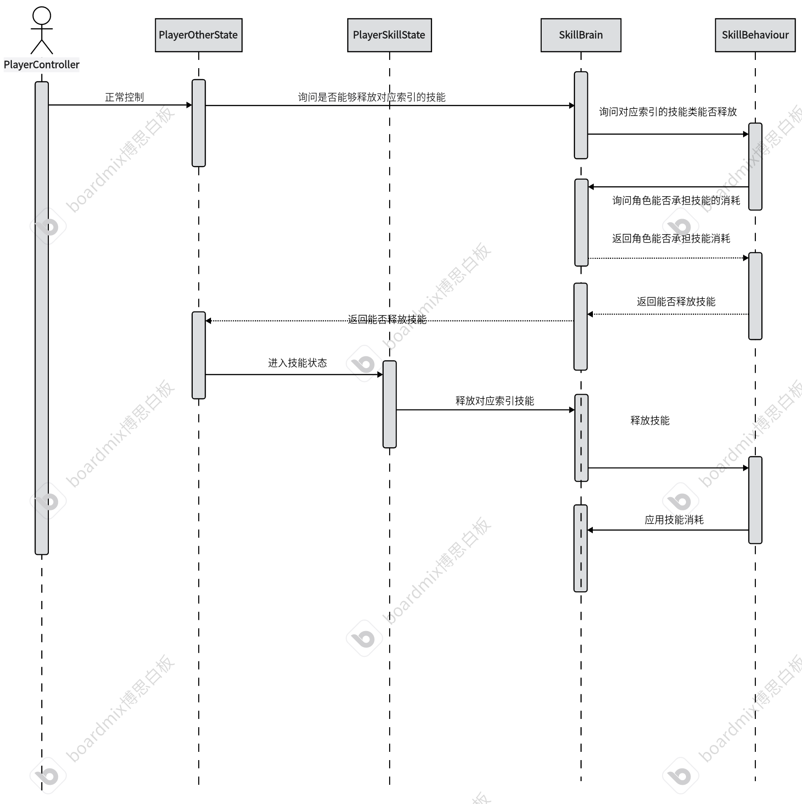

# 事件轨道

创建流程和动画轨道大体相同
但是动画轨道片段滑动是以片段为检测区域的，如果事件轨道还是这样的话，那么就很容易会跟丢鼠标导致滑动失败，所以改由父级检测滑动

# 技能运行时框架
目前技能编辑器是编辑一个技能片段，但是许多游戏一个技能释放会有许多段攻击，这一段段攻击就被分为了一个个技能片段，这些技能片段组合成一起才组成一个技能。

1. SkillBrain:技能的最上层，技能的消耗来源、技能之间的共享数据
   多个技能可能会有关联，比如先放一技能再放二技能可能会有不同的效果(组合技)，它的前提是需要只当技能当前处于的状态。
2. SkillConfig
   1. SkillClips:全部的技能片段
   技能片段不代表他是连续的，比如亚索Q并不是一个技能片段，而是三个技能片段(一段和二段Q,三段的吹风,EQ的旋转)
   2. SkillBehavior:技能逻辑的掌控者，对SkillClips进行状态管理
3. SkillBehavior:
   1. 监听SkillClip中的自定义事件，以及决定播放哪一个SkillClip，对技能进行状态管理
   2. 可以在编辑器所有事件前、后做特殊化处理，可以拦截事件的发生。(比如变身后所有攻击范围加大50%、变身后技能音效改变、致盲后攻击判定无效、亚索EQ、瑞文三段QA等机制，也就是对配置数据进行二次加工来完成特殊逻辑)
4. SkillClip:技能编辑器产出的配置，播放动画、音效、特效、碰撞盒以及向上发出事件
5. SkillPlayer:技能播放器，播放的是SkillClip，将SkillClip中的事件向上发送给SkillBehavior。


## SkillBehavior
它会被SkillConfig持有，但是一个是SO文件，一个是脚本，那么就会产生一个问题，许多角色可以使用同一个技能，也就会持有同一个SO文件，但是这样，SO持有的脚本会被共享，脚本一定要实现一个深拷贝方法

而且它会持有技能驱动时的事件，通过这些事件来操纵角色释放技能时的变化及行为
如驱动技能时事件， 技能片段结束时事件，自定义事件调用前事件，动画事件调用前事件，自定义事件调用后事件，动画事件调用后事件等等

## SkillBrain
1. 有哪些技能
2. 技能的消耗
3. 技能之间的共享数据

## 多阶段技能
类似瑞文，一共释放三次才会进入CD，释放第一段后如果长时间按不释放也会进CD，多段之间也可以穿插普攻

穿插普攻使用SkillBrain的共享数据来完成，可以在ShareData字典里加入一个bool类型的键值对，通过操控它来完成对多个技能之间的交互

## 输入缓存
```cs
using JKFrame;
using System;
using UnityEngine;

public class InputManager : SingletonMono<InputManager>
{
    /// <summary>
    /// 键盘按键
    /// </summary>
    [Serializable]
    public class Key
    {
        public KeyCode keyCode;         //按键
        public bool isCache;            //是否缓存输入
        public float cacheTime;         //缓存输入生命周期
        private float lastInputTime;    //上一次输入时间
        public bool vaild;              //是否有效
        /// <summary>
        /// 获取当前状态
        /// True则为输入状态
        /// </summary>
        /// <returns></returns>
        public bool GetState()
        {
            if (!isCache) return Input.GetKey(keyCode);
            return Input.GetKey(keyCode) || (Time.time - lastInputTime) < cacheTime;
        }
        public void Update()
        {
            if (!isCache) return;
            if (Input.GetKey(keyCode))
            {
                lastInputTime = Time.time;
            }
            vaild = GetState();
        }
    }

    /// <summary>
    /// 鼠标按键
    /// </summary>
    [Serializable]
    public class MouseKey
    {
        public int mouseBtnID;         //按键
        public bool isCache;            //是否缓存输入
        public float cacheTime;         //缓存输入生命周期
        private float lastInputTime;    //上一次输入时间
        public bool vaild;              //是否有效
        /// <summary>
        /// 获取当前状态
        /// True则为输入状态
        /// </summary>
        /// <returns></returns>
        public bool GetState()
        {
            if (!isCache) return Input.GetMouseButton(mouseBtnID);
            return Input.GetMouseButton(mouseBtnID) || (Time.time - lastInputTime) < cacheTime;
        }
        public void Update()
        {
            if (!isCache) return;
            if (Input.GetMouseButton(mouseBtnID))
            {
                lastInputTime = Time.time;
            }
            vaild = GetState();
        }
    }

    public Key[] skillKeys;
    public MouseKey commonAttackKey;

    public void Update()
    {
        commonAttackKey.Update();
        for (int i = 0; i < skillKeys.Length; i++)
        {
            skillKeys[i].Update();
        }
    }

    public Key GetSkillKey(int skillIndex)
    {
        return skillKeys[skillIndex];
    }

    public bool GetSkillKeyState(int skillIndex)
    {
        return skillKeys[skillIndex].GetState();
    }

    public bool GetcommonAttackKeyState()
    {
        return commonAttackKey.GetState();
    }
}

```

# Buff
Buff本质上只是数据的运算，所以只需要形成数据的配置，然后角色或对象注册相关回调即可
1. 可叠加则有层数，不可叠加则覆盖效果
2. 影响的目标属性
3. OnStart、OnTick、OnEnd、当层数变化时的回调

## Buff思路
1. Buff配置：一个Buff一个SO做基础配置，Buff图标，是否叠加等
2. Buff实体:运行时的对象，Buff实体本身不具备扣除玩家生命中相关功能，Buff实际效果由Buff解析器来决定，在Buff开始、Buff每X秒、Buff结束时都调用Buff解析器解析数据
3. Buff解析器:决定Buff到底如何生效，例如"X层中毒，中毒伤害为每层5点"，到底怎么应用数据由解析器来决定，这个过程可能需要调用UI显示Icon、实际扣除玩家生命等可能的操作，假设有一种毒属性怪物，毒Buff甚至能够给他加血