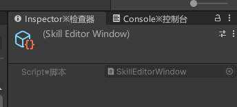

# 技能编辑器

## Inspector绘制方法
为之后所有的TrackItem提供一种绘制的基本方法。

点击动画片段的时候，右边Inspector方法会变化，但是Unity基本方法比较难以做到
因为点击的片段不是继承自UnityEngine.GameObject
但是可以直接在技能编辑器窗口里自己制作

```cs
    public void ShowTrackItemOnInspector(TrackItemBase trackItem)
    {
        Selection.activeObject = this;
    }
```
选中后只会出现

因为EditorWindow继承自ScriptObject，所以会出现这种情况
所以我们要自己去绘制Inspector
```cs
[CustomEditor(typeof(SkillEditorWindow))]
public class SkillEditorInspector : Editor
{
     protected override void OnHeaderGUI()
    {
        base.OnHeaderGUI();
    }

    public override VisualElement CreateInspectorGUI()
    {
        return base.CreateInspectorGUI();
    }
}
```
这个就能够自定义绘制SkillEditorWindow的Inspector界面
写法与UIToolKit类似

```cs
//鼠标按下处监听ShowTrackItemOnInspector方法
private void MouseDown(MouseDownEvent evt)
{
    root.style.backgroundColor = selectColor;
    startDragPosX = evt.mousePosition.x;
    startDragFrameIndex = frameIndex;

    mouseDrag = true;

    SkillEditorWindow.Instance.ShowTrackItemOnInspector(this);
}

public void ShowTrackItemOnInspector(TrackItemBase trackItem)
{
    SkillEditorInspector.SetTrackItem(trackItem);
    Selection.activeObject = this;
}

[CustomEditor(typeof(SkillEditorWindow))]
public class SkillEditorInspector : Editor
{
    public static SkillEditorInspector Instance { get; private set; }
    private static TrackItemBase currentTrackItem;
    public static void SetTrackItem(TrackItemBase trackItem)
    {
        currentTrackItem = trackItem;
        if (Instance != null) //避免已经打开了不刷新数据
        {
            Instance.Show();
        }
    }

    private VisualElement root;

    //主要是重写这个方法来绘制
    public override VisualElement CreateInspectorGUI()
    {
        Instance = this;
        root = new VisualElement();
        Show();
        return root;
    }

    private void Show()
    {
        Clean();
        if (currentTrackItem == null) return;

        //TODO:目前只有动画一种情况
        if (currentTrackItem.GetType() == typeof(AnimationTrackItem))
        {
            DrawAnimationTrackItemGUI((AnimationTrackItem)currentTrackItem);
        }
    }

    /// <summary>
    /// 清除窗口
    /// </summary>
    private void Clean()
    {
        if (root != null)
        {
            for (int i = 0; i < root.childCount; i++)
            {
                root.RemoveAt(i);
            }
        }
    }

    /// <summary>
    /// 绘制动画轨道片段的GUI
    /// </summary>
    private void DrawAnimationTrackItemGUI(AnimationTrackItem animationTrackItem)
    {
        ObjectField animationClipAssetField = new ObjectField("动画资源");
        animationClipAssetField.objectType = typeof(AnimationClip);
        animationClipAssetField.value = animationTrackItem.AnimationEvent.AnimationClip;
        root.Add(animationClipAssetField);
        //TODO:....
    }
}
```

倒着遍历，才不会导致删除后索引发生变化，漏删东西
```cs
    /// <summary>
    /// 清除窗口
    /// </summary>
    private void Clean()
    {
        if (root != null)
        {
            for (int i = root.childCount; i >= 0; i--)
            {
                root.RemoveAt(i);
            }
        }
    }
```

## Inspector交互

记住要保存之前校验

## 编辑器预览
动画、粒子、碰撞体这类一般都需要在编辑器中进行模拟，让用户准确设置技能数据

首先还是让那条线能够指在对应帧上，点击播放，线就一帧帧往下，改变
CurrentSelectFrameIndex，并通过它来驱动技能表现

## 驱动动画表现

```cs
    public override void TickView(int frameIndex)
    {
        GameObject previewGameObject = SkillEditorWindow.Instance.PreviewCharacterObj;
        //根据帧找到目前是哪个动画
        Dictionary<int, SkillAnimationEvent> frameData = AnimationData.FrameData;
        //找到距离这一帧左边最近的一个动画，也就是当前要播放的动画
        int currentOffset = int.MaxValue;//最近的索引距离当前选中帧的偏移量
        int animationEventIndex = -1;
        int tempOffset;
        foreach (var item in frameData)
        {
            tempOffset = frameIndex - item.Key;
            if (item.Key < frameIndex && tempOffset < currentOffset)
            {
                currentOffset = tempOffset;
                animationEventIndex = item.Key;
            }
        }
        if (animationEventIndex != -1)
        {
            SkillAnimationEvent animationEvent = frameData[animationEventIndex];
            //动画资源总帧数
            float clipFrameCount = animationEvent.AnimationClip.length * animationEvent.AnimationClip.frameRate;
            //计算当前播放进度
            float progress = currentOffset / clipFrameCount;
            //循环动画的处理
            if (progress > 1 && animationEvent.AnimationClip.isLooping)
            {
                progress -= (int)progress;
            }
            animationEvent.AnimationClip.SampleAnimation(previewGameObject, progress * animationEvent.AnimationClip.length);
        }
    }
```
主要就是找到当前所在的动画和他的一个进度，