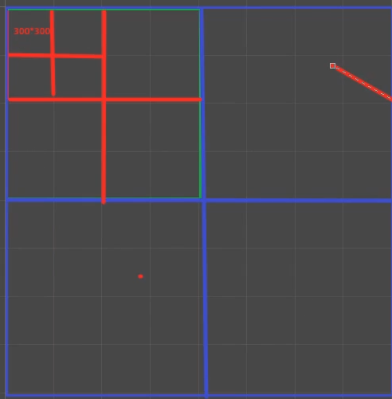

## 四叉树空间管理
1. 用四叉树管理全部地形
2. 视锥体内能看到的范围进行异步加载
3. 由于是异步加载，避免穿帮，实际可见范围要大于视锥体并且在角色附近做九宫格可见。
   
### 四叉树原理
将场景做一个四叉树划分，将地图不断地四分下去，

直到切分到最小颗粒度大小

来通过这些分割后的地图块判断是否在摄像机范围内显示来判断

但是有一个情况就是如果有一个建筑物之类的场景物体，它横跨两个地图块，则需要只有一个地图块在摄像机内也应当完全显示，那可以将这个场景放在这两个地图快的父结点上，则一定会显示了

## 构建四叉树
使用一个四叉树节点类
```cs
    public Bounds bounds;
    private Node leftAndTop;
    private Node leftAndBottom;
    private Node rightAndBottom;
    private Node rightAndTop;
    private bool isTerrain;
    private Vector2Int terrainCoord;
```
节点会包含一个它的包围盒，和他的四个子节点，以及是否是最小颗粒(地形)，及地形坐标
```cs
//分裂
private void Divide()
{
    float halfSize = bounds.size.x / 2;
    float positionOffset = halfSize / 2;
    float halfHeight = mapConfig.terrainMaxHeight / 2;
    Vector3 childSize = new Vector3(halfSize, mapConfig.terrainMaxHeight, halfSize);
    leftAndTop = new Node(new Bounds(new Vector3(bounds.center.x - positionOffset, halfHeight, bounds.center.z + positionOffset), childSize), true);
    leftAndBottom = new Node(new Bounds(new Vector3(bounds.center.x - positionOffset, halfHeight, bounds.center.z - positionOffset), childSize), true);
    rightAndTop = new Node(new Bounds(new Vector3(bounds.center.x + positionOffset, halfHeight, bounds.center.z + positionOffset), childSize), true);
    rightAndBottom = new Node(new Bounds(new Vector3(bounds.center.x + positionOffset, halfHeight, bounds.center.z - positionOffset), childSize), true);
}
```

## 使用四叉树
首先客户端和服务端地图生成的逻辑不一样，因为服务端地图为了性能可以不渲染。
所以会有ClientMapManager和ServerMapManager

## 地块状态
使用一个地块生成控制器，就可以动态地生成对应坐标块的地形。
```cs
/// <summary>
/// 地形状态枚举
/// </summary>
public enum TerrainState
{
    Request, Enable, Disable
}

/// <summary>
/// 地形生成控制器
/// </summary>
public class TerrainController
{
    public static MapConfig mapConfig;
    static TerrainController()
    {
        mapConfig = ClientMapManager.Instance.MapConfig;
    }

    public Terrain terrain;
    public TerrainState state;
    public float destroyTime;
    public void Load(Vector2Int coord)
    {
        Vector2Int resCoord = coord + mapConfig.terrainResKeyCoordOffset;
        string resKey = $"{coord.x}_{coord.y}";
        ResSystem.InstantiateGameObjectAsync<Terrain>(resKey, (terrain) =>
        {
            this.terrain = terrain;
            terrain.basemapDistance = 100;
            terrain.heightmapPixelError = 50;
            terrain.heightmapMaximumLOD = 1;
            terrain.detailObjectDensity = 0.9f;
            terrain.treeDistance = 10;
            terrain.treeCrossFadeLength = 10;
            terrain.treeMaximumFullLODCount = 10;
            terrain.transform.position = new Vector3(coord.x * mapConfig.terrainSize, 0, coord.y * mapConfig.terrainSize);
        }, ClientMapManager.Instance.transform);
    }

    public void Enable()
    {
        if (state != TerrainState.Enable)
        {
            destroyTime = 0;
            state = TerrainState.Enable;
            if (terrain != null)
            {
                terrain.gameObject.SetActive(true);
            }
        }
    }

    public bool CheckDestroy()
    {
        if (state == TerrainState.Disable)
        {
            destroyTime += Time.deltaTime;
            if (destroyTime >= ClientMapManager.Instance.destroyTerrainTime)
            {
                Destroy();
                return true;
            }
        }
        return false;
    }

    public void Disable()
    {
        if (state != TerrainState.Disable)
        {
            state = TerrainState.Disable;
            if (terrain != null)
            {
                terrain.gameObject.SetActive(false);
            }
        }
    }

    public void Destroy()
    {
        ResSystem.UnloadInstance(terrain.gameObject);
        destroyTime = 0;
        terrain = null;
        this.ObjectPushPool();
    }
}
```

## 地块控制
Dictionary<Vector2Int, TerrainController> terrainControllerDic
使用一个字典来维护存在的地块以及它的地形

## 视锥体检测
检测块是否和相机相交，如果相交就递归子块，最后如果是最小子块相交，就显示出来
GeometryUtility.CalculateFrustumPlanes(playerCamera, CameraPlanes);
获得摄像机的六个面，然后用
GeometryUtility.TestPlanesAABB(CameraPlanes, bounds)
来检测地块和摄像机是否相交