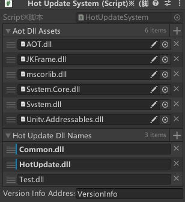

## 角色生成流程
涉及到了服务端和客户端的重构


玩家和AOI不在一个程序集，所以需要一个桥梁机制
使用事件来传递人物移除，人物添加和人物位置更新的事件，来连接AOIManager和PlayerController；

在制作人物控制之类的服务端和客户端都会使用的脚本时，可以使用partial关键字将类分开来实现，将服务端和客户端逻辑分离，逻辑更加清晰。

## 玩家状态与输入
客户端监听、过滤输入传递给服务端
服务端处理输入运行逻辑并同步给客户端

## 网络变量序列化
网络变量的类型如果不是AOT的话，需要手动注册告诉Netcode如何序列化

```cs
 public static void Init()
 {
     BindUserNetworkVaribaleSerialization<PlayerState>();

 }

 public static void BindUserNetworkVaribaleSerialization<T>() where T : unmanaged,Enum
 {
     UserNetworkVariableSerialization<T>.WriteValue = (FastBufferWriter writer, in T value) =>
     {
         writer.WriteValueSafe(value);
     };

     UserNetworkVariableSerialization<T>.ReadValue = (FastBufferReader reader, out T value) =>
     {
         reader.ReadValueSafe(out value);
     };

     UserNetworkVariableSerialization<T>.DuplicateValue = (in T value, ref T duplicateValue) =>
     {
         duplicateValue = value;
     };
 }
 ```

 ## 玩家角色要在服务端基于根运动移动

```cs
public class Player_View : MonoBehaviour
{
#if UNITY_SERVER || UNITY_EDITOR
    [SerializeField] private Animator animator;

    private Action<Vector3, Quaternion> rootMotionAction;

    private void OnAnimatorMove()
    {
        rootMotionAction?.Invoke(animator.deltaPosition, animator.deltaRotation);
    }

    public void SetRootMotionAction(Action<Vector3, Quaternion> rootMotionAction)
    {
        this.rootMotionAction = rootMotionAction;
    }

    public void CleanRootMotionAction()
    {
        this.rootMotionAction = null;
    }
#endif
}
```
使用一个事件去监听动画移动的事件OnAnimatorMove()，当动画移动的时候就去使用CharacterController中的移动方法去移动对应的位置和旋转变化。
```cs
    player.Player_View.SetRootMotionAction(OnRootMotion);
    private void OnRootMotion(Vector3 deltaPosition, Quaternion deltaRotation)
    {
        player.Animator.speed = player.MoveSpeed;
        deltaPosition.y -= player.Gravity * Time.deltaTime;
        player.CharacterController.Move(deltaPosition);
        //更新AOI
        if(deltaPosition != Vector3.zero)
        {
            player.UpdateAOICoord();
        }
    }
```

## 网络变量热更新
网络变量在NetworkBehaviour中会去检查它的状态，回去遍历所有的网络的变量
检查他是否更新过，如果不一样说明需要修改来同步
但前提是客户端有权限去修改
检查更新时会去执行一个IsDirty方法来看它是否是脏的
所以如果想要不报错可以直接写一个新的类继承自NetworkVariable
并且重写IsDirty方法。
```cs
    public override bool IsDirty()
    {
        //本项目中客户端没有修改网络变量的权力，所以直接过滤且避免NetworkVariableSerialization<T>.AreEqual为null的情况
        if (NetworkVariableSerialization<T>.AreEqual == null)
        {
            return false;
        }
        return base.IsDirty();
    }
```

玩家销毁时StateMachine需要销毁

## 玩家移动状态
输入逻辑：
1. 玩家在客户端的鼠标会让摄像机旋转
2. 玩家的WASD实际上是**希望角色相对目前摄像机的某个方向进行旋转**
3. 具体移动是动画的根运动驱动的


加载热更新程序集的时候 要注意顺序，如果HotUpdate是依赖Common程序集的，那么就需要先加载Common程序集，不然的话就会报错，无法找到依赖程序集
