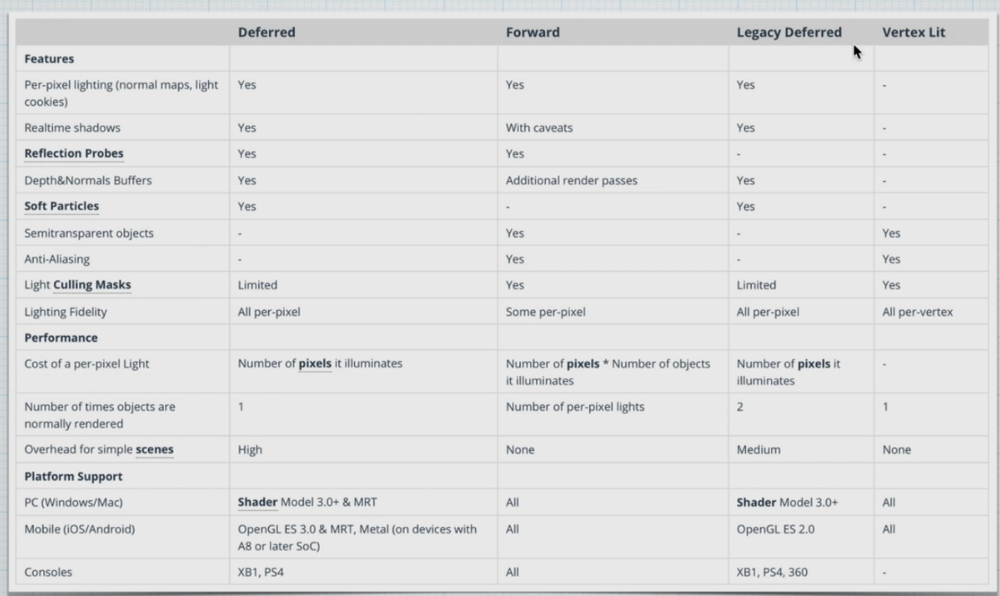

## 光照
计算机图形学使用几何光学，但是模型过于复杂，所以相比物理学的几何光学模型做了简化
使用了更加经验的模型
1. 物体表面是绝对光滑的
2. 光只可以被发射，反射或者传播
3. 光速无穷大

表面颜色 = 镜面反射 + 漫反射

## 光照模型

经验型:
1. Lambert
2. Phong
3. Blinn-Phong

物理型:
1. PBR 基于物理渲染


## 渲染路径RenderingPath
为进行光照计算而设计的渲染方式

1. 前向渲染路径(Forward Rendering Path) 默认渲染路径
2. 延迟渲染路径(Deferred Rendering Path)
   高保真的获得光照效果
3. 顶点照明渲染路径(Vertex Lit Rendering Path,Legacy) 
   效果比较差
4. 旧的延迟渲染路径(Legacy)

3和4都是比较老的，不常用了

### 顶点照明渲染路径
1. 性能最优
2. 支持硬件最广
3. 一个物体仅仅渲染一次，并且所有的光照计算都在顶点执行

1. 不支持像素级别的效果，比如阴影、高质量高光等


### 延迟渲染路径
将着色计算进行延后处理的一种渲染路径

SubShader内每个Pass都会默认执行
而延迟渲染会写两个Pass
几何处理 G-Buffer Pass
光照处理Lighting PAss

几何渲染会生成多个纹理来存储发现，漫反射，高光等信息
最后全部存入G-Buffer 几何缓冲区，所以他需要很大的显存空间
然后进入光照处理，只需要渲染出一个屏幕大小的二维矩形，使用G-Buffer中的数据对矩阵中的每个片段进行计算光照并且着色

优点:
1. 影响一个物体的光源数量是没有限制的
2. 每一个光源都可以是住像素级别的效果，并且可以正确的计算法线贴图及阴影
缺点:
1. 不支持半透明效果
2. 不支持抗锯齿
3. 内存开销比较大
4. 不支持正交相机
显卡必须支持MRT，ShaderModel在3.0以上，手机平台在OpenGL3.0以上

### 前向渲染路径
介于顶点照明渲染路径和延迟渲染路径之间
一个物体在收到多个灯光影响时，可能会产生一个或者多个Pass，具体取决于多个因素
#### 渲染方式
1. 逐像素
2. 逐顶点
3. SH球谐 

1. 如果一个灯被标记为NotImportant，这个灯会采用逐顶点或者SH，效果会比较差，但是性能就会更好 
2. 最亮的一盏平行灯采用逐像素，这个是自动的
3. 被标记为Important的灯会采用逐像素
4. 如果上面产生逐像素的灯数量小于工程中的像素灯的数量，则会有更多的灯采用逐像素

1. ForwardBase 仅用于一个逐像素的平行灯，以及所有的逐顶点与SH
2. ForwardAdd 用于其他所有的逐像素灯


## Lambert光照模型
Diffuse = Ambient + KD * LightColor * dot(N,L)

## 不同灯光类型的支持与区分
为Pass添加ForwardBase，物体就会接收主灯光的光照
添加ForawrdAdd，物体才会接收其他光照
#pragma multi_compile_fwdadd，使用宏命令对不同光照做处理

## 光照衰减原理
使用一个光照贴图，通过距离来采样这张贴图来控制它的光照大小
Unity默认的方式，采样速度很快

## Phong光照模型
为了解决高光的问题
Specular = SpecularColor * Ks * pow(max(0,dot(R,V)),Shininess)
Ks 反射系数
R 反射单位向量 
Shininess 高光指数，用于模拟高光的范围 

fixed4 c = 0;
//Diffuse = Ambient + Kd * lightColor * dot(n,L)
fixed4 ambient = unity_AmbientSky;
half Kd = _DiffuseIntensity;
fixed4 LightColor = _LightColor0;
fixed3 N = normalize(i.worldNormal);
fixed3 L = _WorldSpaceLightPos0;
fixed4 Diffuse = ambient + Kd * LightColor * max(dot(N, L), 0);
c += Diffuse;
fixed3 V = normalize(_WorldSpaceCameraPos - i.worldPos);
//fixed3 R = 2 * dot(N,L) * N - L;
fixed3 R = reflect(-L, N);
fixed4 Specular = _SpecularColor * _SpecularIntensity * pow(max(0, dot(R, V)), _Shininess);
c += Specular;
return c;

### Blinn-Phong实现
Specular = SpecularColor * Ks * pow(max(0,dot(N,H)),Shininess)
N: 反射单位向量
H 入射光线L与射线V的中间向量

## 深度缓冲区
每个顶点的深度由顶点在摄像机中的垂直距离的来计算
在光栅化的时候，会进行插值，并将值填入到每一个片元的深度缓冲中
深度值范围[0,1]，是呈非线性的，因为近处要求精度更高，所以在小的范围精度比较高，而在远处要求不高，精度比较小

### 深度写入
更新深度缓冲区中的值
ZWrite On(默认写入)
ZWrite Off

### 深度测试
可以选择对比的方式，回去和深度缓冲区的值进行对比返回一个结果 
ZTest

## X光
菲涅尔反射
```cpp
 fixed4 c = 1;
 fixed3 V = normalize(_WorldSpaceCameraPos - i.worldPos);
 fixed3 N = normalize(i.worldNormal);
 fixed VdotN = dot(V, N);
 fixed fresnel = 2 * pow(1 - VdotN, 2);
 return fresnel;
 ```

## 阴影
阴影可以增加真实感
阴影实际上是光线被阻挡的结果
1. ShadowMapping常用的实时阴影生成方法
2. ShadowMap是动态生成的阴影纹理图，在需要时对其采样来获阴影
1. 在光源出添加一个相机，打开深度测试和写入，生成ShadowMap
2. 正常绘制场景，将当前片段转换到光源空间下，计算得到的深度和采样ShadowMap中的深度值进行比较，如果大于则表示该片段在阴影中，反之不在

### 网格阴影原理
1. 实现简单
2. 效果实时，清晰

1. 需要两个Pass来渲染
2. 在地面起伏较大时容易穿帮