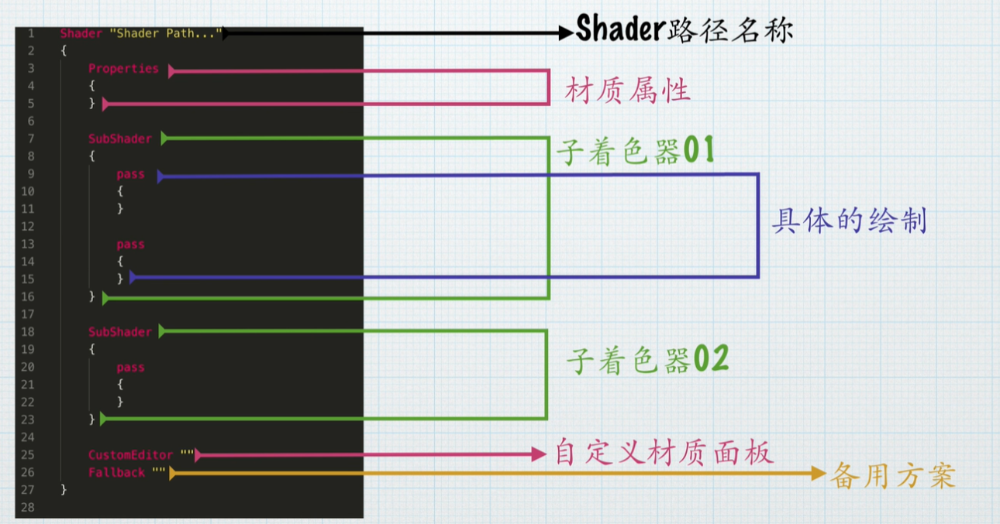
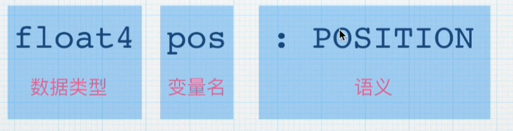
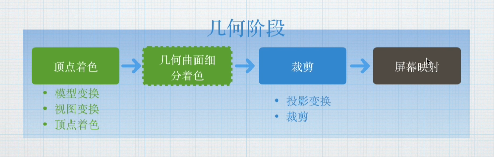
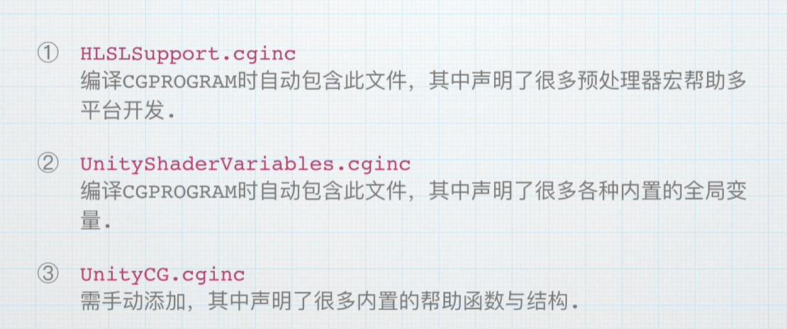
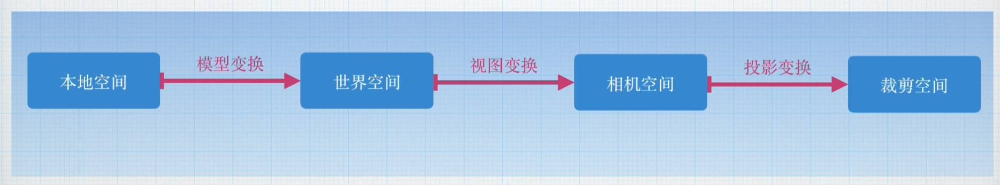
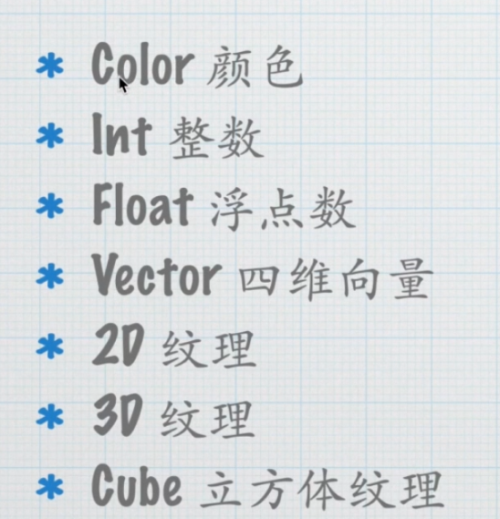

## 无光照着色器

会不断查找SubShader并执行，如果都不执行，就执行Fallback

Properties里会声明材质面板需要修改的参数

CustomEditor "" 自定义材质面板
里面参数是一个脚本

float 32位
half 16位
fixed 8位

Integer
sampler2D
samplerCUBE

## 结构与语义

语义就是告诉Shader谁是谁
float4 pos:POSITION;

## 几何阶段

基本就是制作顶点着色器部分，大多都是做变换矩阵

模型变换 视图变换

## 空间变化

## 光栅化

三角形设置根据点组装成一个个三角形，之后再进行三角形遍历。找出所有属于对应三角形的片段。再进行插值，根据顶点数据进行插值

### 片段着色器

## 变量和类型

整数在面板中能赋值位小数，但是运算的时候会向下取整，在shader还是会认为是整数值

