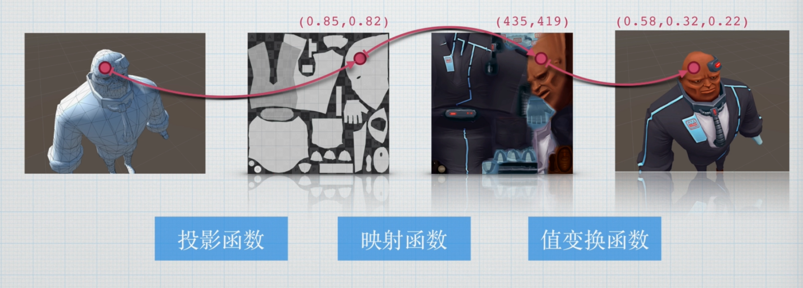

# 纹理


如果想要让角色有凹凸效果，可以使用纹理来做，否则用面来模拟凹凸会很消耗性能

## uv的Tiling和Offset

sampler2D _DissolveTex;
float4 _DissolveTex_ST;

如果想要修改，那么就需要在声明一个float4变量存储
Tiling和Offset

```cpp
fixed dissolveTex = tex2D(_DissolveTex,i.uv * _DissolveTex_ST.xy + _DissolveTex_ST.zw);

//o.uv.zw = v.uv * _DissolveTex_ST.xy + _DissolveTex_ST.zw;
o.uv.zw = TRANSFORM_TEX(v.uv,_DissolveTex);


```
## 剔除
一般都是要在片段着色器里写
clip(X)函数，如果小于0就会直接剔除这个片段
也就是不会绘制它


## 溶解

```cpp
fixed4 frag(v2f i):SV_Target
{
    fixed4 tex = tex2D(_MainTex, i.uv.xy);

    fixed4 dissolveTex = tex2D(_DissolveTex,i.uv.zw);
    clip(dissolveTex.r - _Clip);
    fixed4 rampTex = tex2D(_RampTex,smoothstep(_Clip,1,dissolveTex.r));
    return tex * _Color + rampTex;
}
```
通过
fixed4 rampTex = tex2D(_RampTex,smoothstep(_Clip,1,dissolveTex.r));
那么当改变Clip值的时候，每个片段，它的一个平滑值也会改变，这样子溶解的那个缺口边上那一圈总是会采样到0，那么就会呈现白色。

fixed4 rampTex = tex2D(_RampTex,smoothstep(_Clip,_Clip + 0.1,dissolveTex.r));
通过将范围缩小，来达到溶解范围不会那么大，更加真实