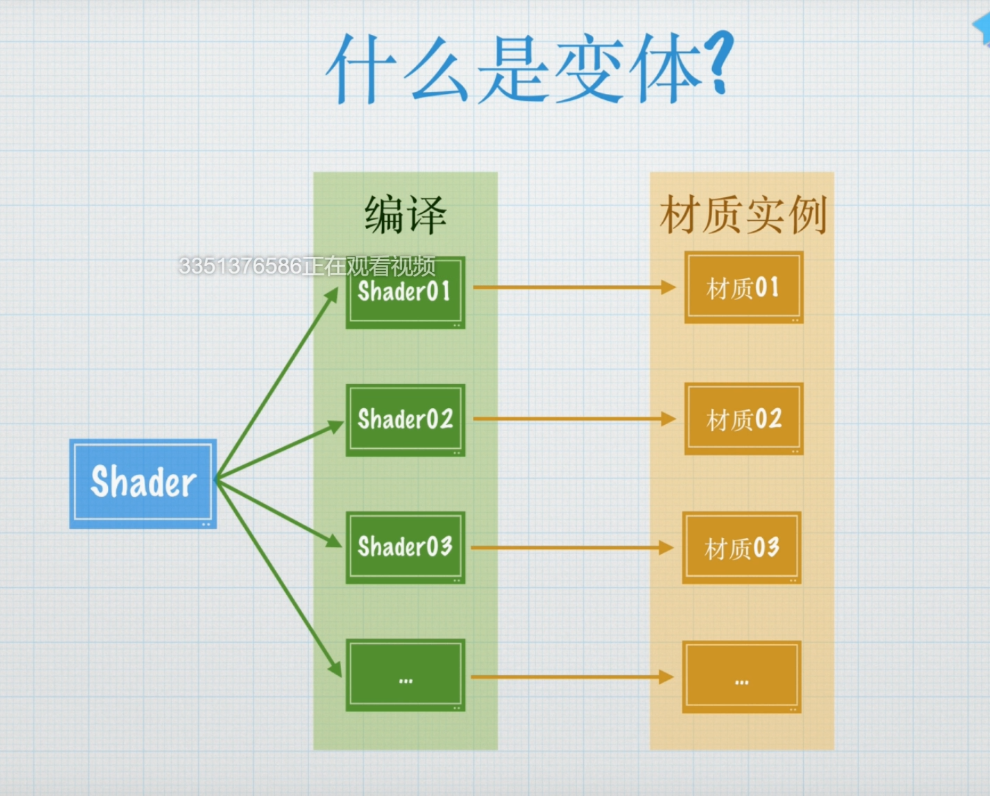

## 变体
Shader一个文件是可以编译为多个Shader文件的

而材质引用的内部编译后的Shader


## 优缺点
1. 可以将多个功能和效果集成到一个Shader内，便于使用与管理
2. 变体数量过多会导致加载事件过长与内存占用增加

## 变体的类型
1. 无论如何都会被编译的变体，
2. 通过材质的使用情况来决定是否编译的变体

```cpp
 [Toggle]_DissolveEnable("DissolveEnable",Int) = 0

#pragma multi_compile _ _DISSOLVEENABLE_ON

#if _DISSOLVEENABLE_ON
    fixed4 dissolveTex = tex2D(_DissolveTex,i.uv.zw);
    clip(dissolveTex.r - _Clip);
    //fixed4 rampTex = tex2D(_RampTex,smoothstep(_Clip,_Clip + 0.1,dissolveTex.r));
    fixed4 rampTex = tex2D(_RampTex,saturate((dissolveTex.r-_Clip)/0.1));
    color = color + rampTex;
#endif
```
声明变体
_代表是空变体，
默认会使用没打开DISSOLVE的变体
然后可以通过程序动态地去更改这个变体
如果想要在属性中配置它的开启和关闭，一定要名字相同
后面再加_ON;

### shader_feature

通过材质使用情况来决定是否编译的变体
