## Shader
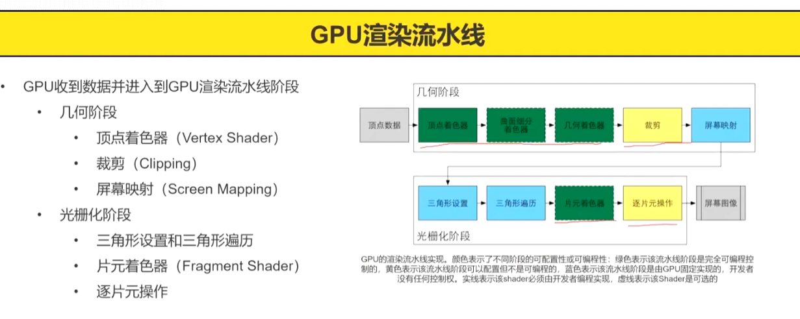

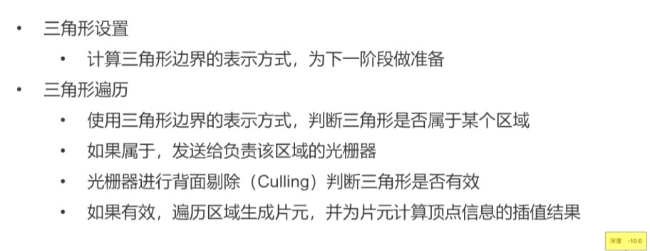

### 几何阶段
1. 顶点着色器
2. 裁剪
3. 屏幕映射

### 光栅化阶段
1. 三角形设置和三角形遍历
2. 片元着色器
3. 逐片元操作
   1. 可见性测试:深度测试，模板测试
   2. 混合片元颜色和缓冲区的现有颜色:透明混合

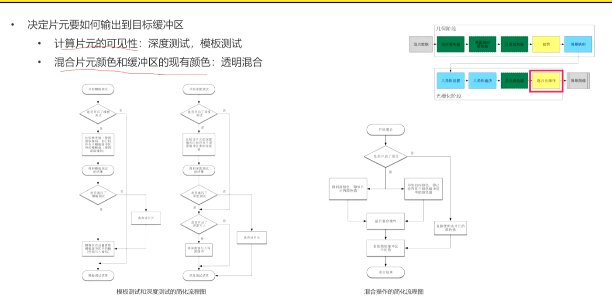
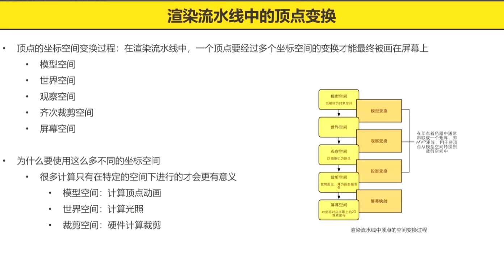
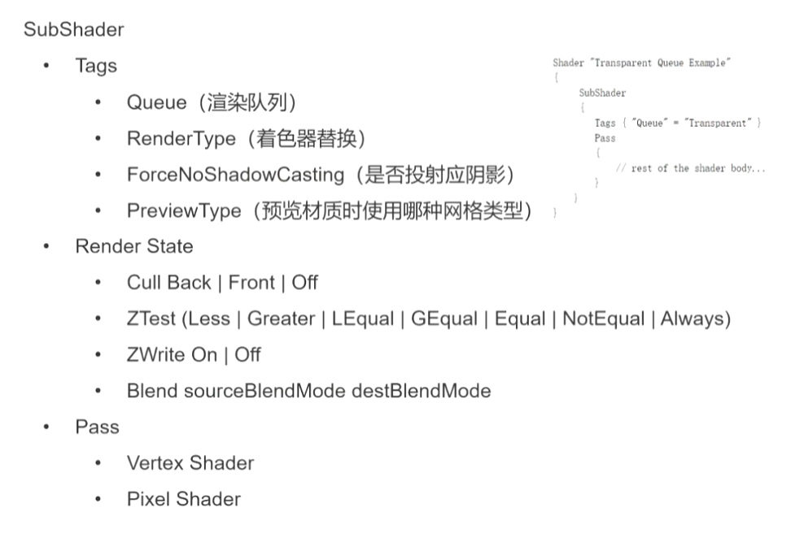

## 帧缓冲区

用来存放一帧中数据信息的容器，
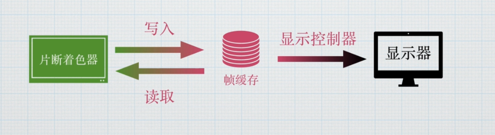

帧缓冲区不是只有一个，而是会有多个缓冲区
深度缓冲区，颜色缓冲区，模板缓冲区，自定义缓冲区

片段在写入帧缓冲之前会按顺序经历一系列测试
Alpha测试
模板测试
深度测试

片段在写入帧缓冲之时会进行一些运算
混合

### 显示器扫描方式
1. 随机扫描显示器
根据需要绘制的图形去绘制
图形复杂的时候没有办法很好的显示，所以现在已经被淘汰

2. 光栅扫描显示器
从屏幕左上角一行一行往下绘制。
线路简单，无论多复杂的画面，一视同仁，上限极高

### 帧缓冲方式
单缓冲
双缓冲
有两个缓冲，片段着色器会先写入后缓冲，之后后缓冲会复制到前缓冲。
可以保证每一帧都是完整画面，防止画面撕裂

### 颜色缓冲区
存储每帧颜色信息的缓冲区
24位颜色，大部分显示器使用的位数，也就是3b
1920*1080分辨率占用 1920*1080*3/1024/1024=5.93mb显存

### 清除缓冲区
Clear(color + z + stencil)
Z:深度缓冲
stencil:模板缓冲

## 渲染排序
Blend One One
之后应当能透视，但是拖动摄像机会出现有些时候不能透视的情况
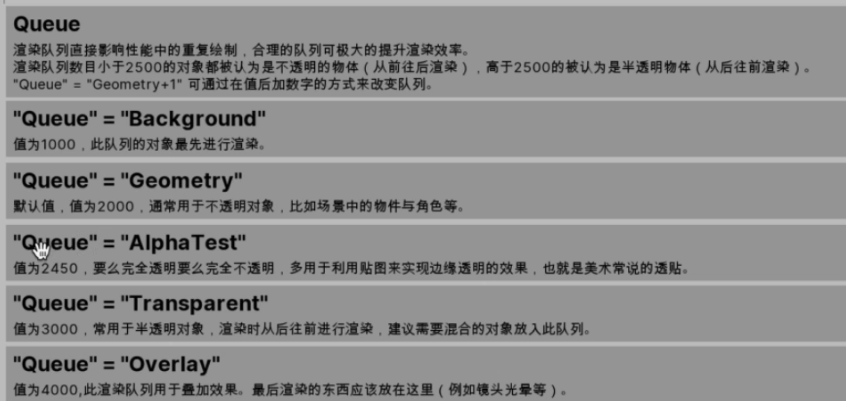
可以通过修改渲染队列数值来更改渲染顺序
小于2500 从前往后渲染(不透明物体)
大于2500从后往前渲染(半透明物体)

## 混合模式Blend
### 混合的作用
实现各种半透明操作

### 混合操作
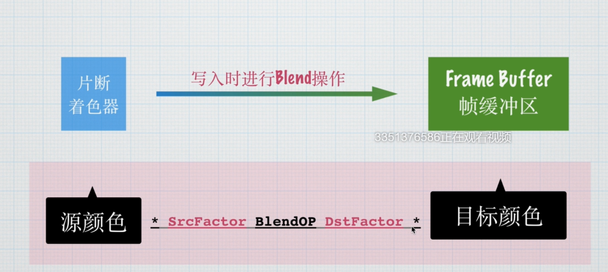
通过一个公式来混合

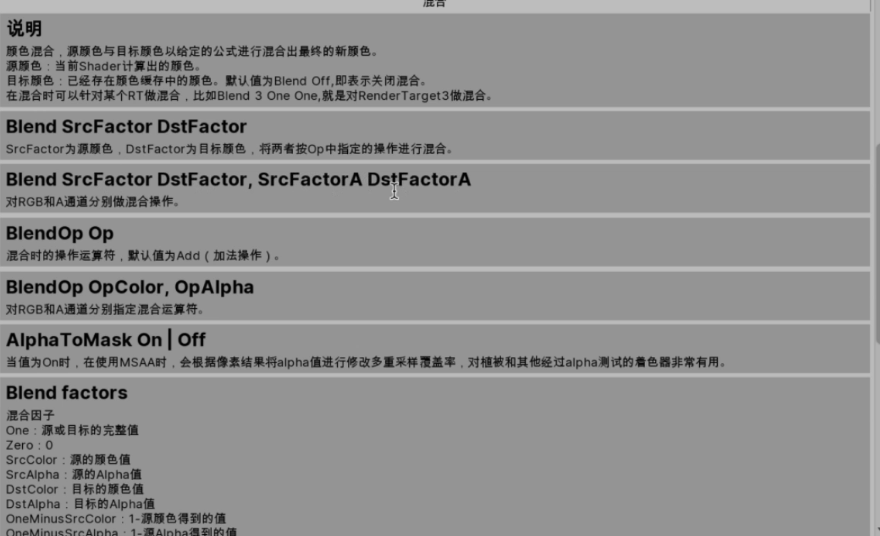

```cpp
[Enum(UnityEngine.Rendering.BlendMode)]_SrcBlend("Src Blend",Int) = 0
[Enum(UnityEngine.Rendering.BlendMode)]_DstBlend("Des Blend",Int) = 0


Blend [_SrcBlend] [_DstBlend]
```

## 面剔除Cull
Cull Off|Back|Front

一个面只有正面和反面
所以可以选择剔除

主要是为了渲染优化
[Enum(UnityEngine.Rendering.CullMode)]_Cull("Cull",Int) = 0
### 如何判断正反面
默认是剔除背面

## Shader中的时间 _Time

_Time.xyzw

_Time.x(t/20)
_Time.y(t)
_Time.z(t*2)
_Time.w(t*3)


## CustomData
粒子系统中的值，可以把自己定义的数据传到Shader里面去，
然后就可以去做一些效果

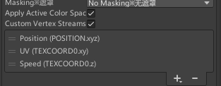

定义好之后就可以在Shader用去使用
o.speed = v.uv.z;

之后你在面板中修改粒子速度的时候，值也会同时影响到Shader
其实就相当于将粒子系统中的数值配置到appdata，也就是输入的数据中

## 屏幕坐标

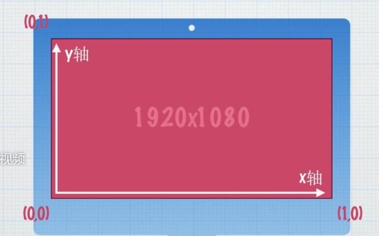
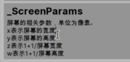

```cpp
//当前像素
UNITY_VPOS_TYPE screenPos : VPOS
```