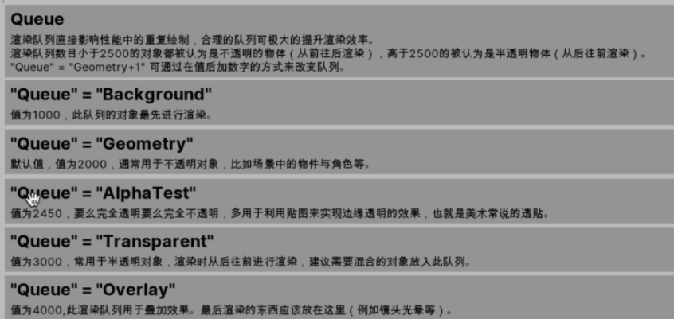
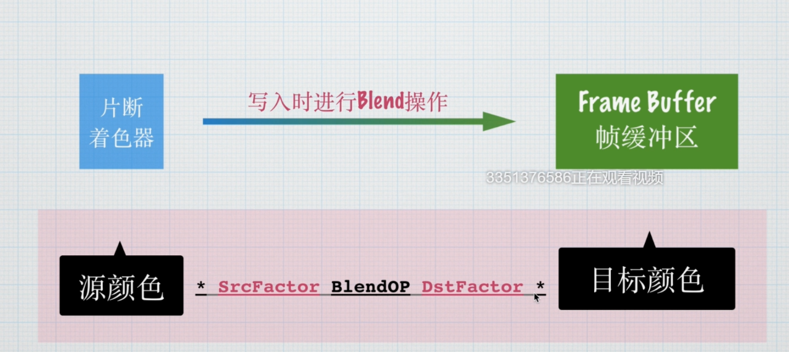
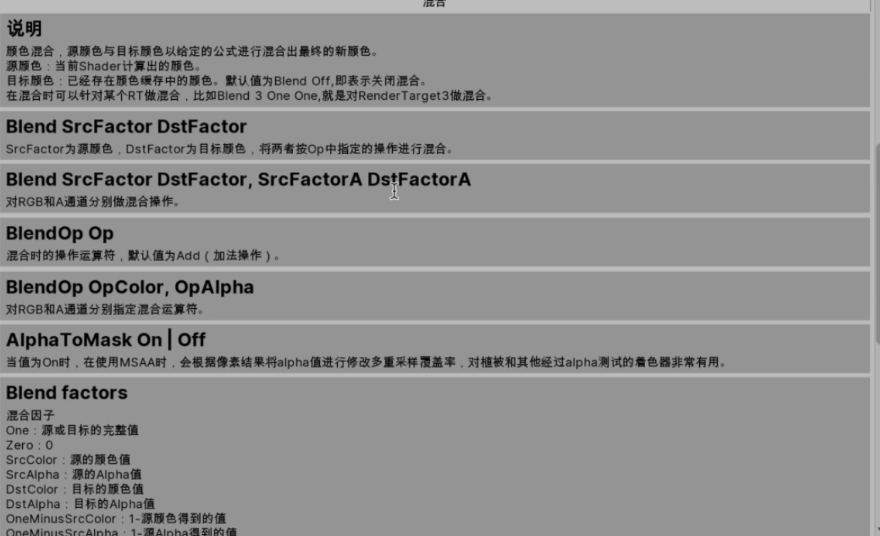

## 需求分析
1. 半透明效果，可设置不同的混合叠加模式
2. 可单面显示，也可以双面显示
3. 纹理自流动
4. 遮罩功能
5. UV扭曲效果
6. 溶解效果

## 渲染排序
Blend One One
之后应当能透视，但是拖动摄像机会出现有些时候不能透视的情况

可以通过修改渲染队列数值来更改渲染顺序
小于2500 从前往后渲染(不透明物体)
大于2500从后往前渲染(半透明物体)

## 混合模式Blend
### 混合的作用
实现各种半透明操作

### 混合操作

通过一个公式来混合



```cpp
[Enum(UnityEngine.Rendering.BlendMode)]_SrcBlend("Src Blend",Int) = 0
[Enum(UnityEngine.Rendering.BlendMode)]_DstBlend("Des Blend",Int) = 0


Blend [_SrcBlend] [_DstBlend]
```

## 面剔除Cull
Cull Off|Back|Front

一个面只有正面和反面
所以可以选择剔除

主要是为了渲染优化
[Enum(UnityEngine.Rendering.CullMode)]_Cull("Cull",Int) = 0
### 如何判断正反面
默认是剔除背面

## Shader中的时间 _Time

_Time.xyzw

_Time.x(t/20)
_Time.y(t)
_Time.z(t*2)
_Time.w(t*3)

## 遮罩实现

使用一张黑白的遮罩贴图，通过采样纹理并将颜色相乘将黑色部分剔除

## UV扭曲效果
需要一张扭曲纹理

## 扭曲效果

特效中常见的扭曲效果(热扭曲)
水体等特殊表现的地方

1. 扭曲材质赋予面片
2. 抓取当前一帧的图片内容
3. 抓取屏幕坐标
4. 利用屏幕坐标对抓取的图片采样
5. 再采样张扰动贴图做扭曲


```cpp
fixed4 frag(v2f i,UNITY_VPOS_TYPE screenPos : VPOS) : SV_Target
{
    fixed2 screenUV = screenPos.xy / _ScreenParams.xy;

    fixed4 distortTex = tex2D(_DistortTex,i.uv);
    float2 uv = lerp(screenUV,distortTex,_Distort);
    fixed4 grabTex = tex2D(_GrabTex, uv);
                return grabTex;
}
```
主要就是通过一个扭曲贴图和场景屏幕截取，在两者之间插值来表示它的一个扭曲程度

## UI材质需求

1. 基础纹理采样
2. 支持组件中的调色功能
3. 遮罩支持
4. 去色功能 

UIShader使用参数 
Properties
{
    [PerRendererData]_MainTex("MainTex",2D)="white"{}
}
会自动将UI的图片填入该贴图格中

fixed4 color:COLOR;
这个语义在UI中就是UI的颜色