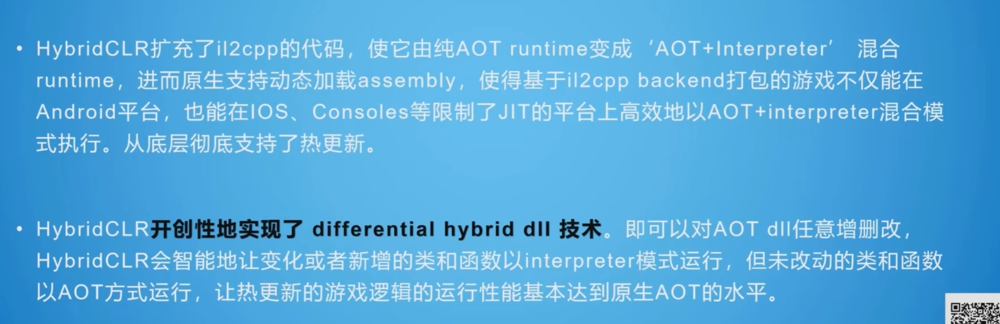

## ToLua/Xlua
使用Lua语言，并且使用一个Lua虚拟机
是一个弱类型、无精确代码提示、要学习并精通第二门语言
性能也低

## ILRuntime
使用C#，使用Mono虚拟机
需要适配ILRuntime

## HybridCLR
使用C#
不需要虚拟机，所以无感透明，且性能非常高。
[官方文档](https://code-philosophy.com/)

## 热更新流程
制作游戏更新后，打包上传资源更新服务器。
玩家启动游戏后回去检查服务器的对比文件，如果有不同，那么就会下载更新包。

### 资源热更新
非常简单，使用AB包和Addressable都可以

### 代码热更新
C#是编译型语言，脚本资源以DLL文件的形式存放在磁盘上。

使用HybridCLR必须改为il2cpp模式

C++不像C#由完整类型信息，所以为了获取完整类型信息，
所以会有一个泛型方法，泛型数据类型等问题。

华佗相当于一个虚拟机(不等于)
它编译了要热更的代码。
热更代码在 IL 到IL2cpp之间的阶段编译。

