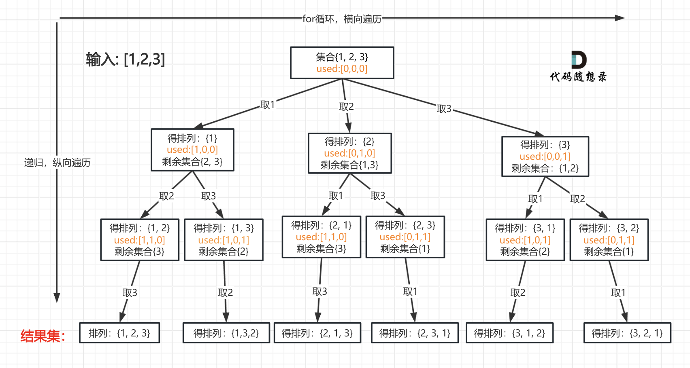

# 回溯算法概述
回溯法也可以叫做回溯搜索法，它是一种搜索的方式。
虽然回溯法很难，很不好理解，但是回溯法并不是什么高效的算法。

因为回溯的本质是穷举，穷举所有可能，然后选出我们想要的答案，如果想让回溯法高效一些，可以加一些剪枝的操作，但也改不了回溯法就是穷举的本质。
回溯法，一般可以解决如下几种问题：

1. 组合问题：N个数里面按一定规则找出k个数的集合
2. 切割问题：一个字符串按一定规则有几种切割方式
3. 子集问题：一个N个数的集合里有多少符合条件的子集
4. 排列问题：N个数按一定规则全排列，有几种排列方式
5. 棋盘问题：N皇后，解数独等等

回溯法解决的问题都可以抽象为树形结构，是的，我指的是所有回溯法的问题都可以抽象为树形结构！

因为回溯法解决的都是在集合中递归查找子集，集合的大小就构成了树的宽度，递归的深度就构成了树的深度。

递归就要有终止条件，所以必然是一棵高度有限的树（N叉树）。

回溯模板
```cpp
void backtracking(参数) {
    if (终止条件) {
        存放结果;
        return;
    }

    for (选择：本层集合中元素（树中节点孩子的数量就是集合的大小）) {
        处理节点;
        backtracking(路径，选择列表); // 递归
        回溯，撤销处理结果
    }
}
```
# 题目

## [组合](https://leetcode.cn/problems/combinations/description/)
### 题解

使用回溯算法，还是要明白回溯三部曲，
### 代码
```c++
class Solution {
public:
    vector<vector<int>> result;
    vector<int> path;
    void backTracking(int n, int k, int startIndex){
        if(path.size() == k ){
            result.push_back(path);
            return;
        }
        for(int i = startIndex; i <= n; i++){
            path.push_back(i);
            backTracking(n,k,i+1);
            path.pop_back();
        }
    }
    vector<vector<int>> combine(int n, int k) {
        backTracking(n,k,1);
        return result;
    }
};
```

## [组合总和Ⅲ](https://leetcode.cn/problems/combination-sum-iii/description/)
### 题解

### 代码
```cpp
class Solution {
public:
    vector<vector<int>> result;
    vector<int> path;
    void backTracking(int targetSum, int k,int sum, int startIndex){
        if(path.size() == k){
            if(sum == targetSum) result.push_back(path);
            return;
        }
        for(int i = startIndex; i<=9; i++){
            sum+=i;
            path.push_back(i);
            backTracking(targetSum,k,sum,i+1);
            sum-=i;
            path.pop_back();
        }
    }
    vector<vector<int>> combinationSum3(int k, int n) {
        backTracking(n,k,0,1);
        return result;
    }
};
```

## [电话号码的字母组合](https://leetcode.cn/problems/letter-combinations-of-a-phone-number/description/)
### 题解

回溯算法，需要有终止条件，处理节点，递归，和处理回溯。
在本题中，首先将数字字符映射为英文字符。
什么时候终止(也就是将获取到的s放入result)，此题显然就是输入数字字符串的长度。
然后该怎么处理呢，遍历字符串长度，这样就可以获取第一个数字对应所有字符串，然后再递归调用，将index+1，则可以获取下一个数字对应字符串。而在达到终止条件时，会return，即回溯，此时就要将s里的给pop一个出来，继续遍历下一个可能，这样回溯下去，最后就能得到所有情况。
### 代码
```cpp
class Solution {
    const string letterMap[10] ={
        "",
        "",
        "abc",
        "def",
        "ghi",
        "jkl",
        "mno",
        "pqrs",
        "tuv",
        "wxyz",
    };
public:
    vector<string> result;
    string s;
    void backtracking(const string& digits,int index){
        if(index == digits.size()){
            result.push_back(s);
            return;
        }
        int digit = digits[index] - '0';
        string letters = letterMap[digit];
        for(int i = 0; i < letters.size();i++){
            s.push_back(letters[i]);
            backtracking(digits,index+1);
            s.pop_back();
        }
    }
    vector<string> letterCombinations(string digits) {
        if(digits.size() == 0){
            return result;
        }
        backtracking(digits,0);
        return result;
    }
};
```

## [组合总和](https://leetcode.cn/problems/combination-sum/description/)
### 题解

还是一样的回溯，终止条件就是当总和大于等于目标值，如果大于就直接返回，如果等于那就给他写入result。
但是他是允许数值重复的，所以再递归的时候不要将index+1，直接就用原本的index来递归就好了。
### 代码
```cpp
class Solution {
public:
    vector<vector<int>> result;
    vector<int> path;
    void backtracking(vector<int>& candidates,int target,int sum,int startIndex){
        if(sum > target)
            return;
        if(sum == target){
            result.push_back(path);
            return;
        }
        for(int i = startIndex; i < candidates.size(); i++){
            sum += candidates[i];
            path.push_back(candidates[i]);
            backtracking(candidates,target,sum,i);
            sum-=candidates[i];
            path.pop_back();
        }
    }
    vector<vector<int>> combinationSum(vector<int>& candidates, int target) {
        backtracking(candidates,target,0,0);
        return result;
    }
};
```

## [组合总和Ⅱ](https://programmercarl.com/0040.%E7%BB%84%E5%90%88%E6%80%BB%E5%92%8CII.html)
### 题解

他是不能重复的，而且要做去重操作，可以将这个数组先排序，毕竟题目不要求按顺序输出，然后当i>startIndex时如果当前元素和前一个相同，那么就直接continue，不做判断，这样就去重了。
### 代码
```cpp
class Solution {
private:
    vector<vector<int>> result;
    vector<int> path;
    void backtracking(vector<int>& candidates, int target, int sum, int startIndex) {
        if(sum > target)
            return;
        if (sum == target) {
            result.push_back(path);
            return;
        }
        for (int i = startIndex; i < candidates.size(); i++) {
            // 要对同一树层使用过的元素进行跳过
            if (i > startIndex && candidates[i] == candidates[i - 1]) {
                continue;
            }
            sum += candidates[i];
            path.push_back(candidates[i]);
            backtracking(candidates, target, sum, i + 1); // 和39.组合总和的区别1，这里是i+1，每个数字在每个组合中只能使用一次
            sum -= candidates[i];
            path.pop_back();
        }
    }

public:
    vector<vector<int>> combinationSum2(vector<int>& candidates, int target) {
        // 首先把给candidates排序，让其相同的元素都挨在一起。
        sort(candidates.begin(), candidates.end());
        backtracking(candidates, target, 0, 0);
        return result;
    }
};
```

## [分割回文串](https://leetcode.cn/problems/palindrome-partitioning/description/)
### 题解

其实切割问题类似组合问题。

例如对于字符串abcdef：

组合问题：选取一个a之后，在bcdef中再去选取第二个，选取b之后在cdef中再选取第三个.....。
切割问题：切割一个a之后，在bcdef中再去切割第二段，切割b之后在cdef中再切割第三段.....。

首先定义一个是否为回文串的方法，然后按回溯模板来，终止条件的话，就是如果startIndex >= s.size()的时候，那么就代表所有的字符串都已经被分割好了，所以这个时候给他写入result。
而主要时对回溯操作的问题，如果分割之后的字符串不是回文串，那么就直接continue，如果是，那就继续去遍历。
### 代码
```cpp
class Solution {
public:
    vector<vector<string>> result;
    vector<string> path; // 放已经回文的子串
    bool isPalindrome(const string& s, int start, int end) {
        for (int i = start, j = end; i < j; i++, j--) {
            if (s[i] != s[j]) {
                return false;
            }
        }
        return true;
    }
    void backtracking (const string& s, int startIndex) {
        if (startIndex >= s.size()) {
            result.push_back(path);
            return;
        }
        for (int i = startIndex; i < s.size(); i++) {
            if (isPalindrome(s, startIndex, i)) { // 是回文子串
                // 获取[startIndex,i]在s中的子串
                string str = s.substr(startIndex, i - startIndex + 1);
                path.push_back(str);
            } else {                // 如果不是则直接跳过
                continue;
            }
            backtracking(s, i + 1); // 寻找i+1为起始位置的子串
            path.pop_back();        // 回溯过程，弹出本次已经添加的子串
        }
    }
    vector<vector<string>> partition(string s) {
        backtracking(s, 0);
        return result;
    }
};
```

## [复原IP地址](https://leetcode.cn/problems/restore-ip-addresses/description/)
### 题解

首先还是制作一个判断字符串是否合法的方法，如果0开头数字不合法，遇到非数字字符不合法，数字大于255也不合法。
之后定义一个点号次数，终止条件就是当有3个点号时就说明前三个数字合法，此时再判断最后一个数字是否合法，如果合法就可以直接写入result。。而在回溯法中，如果字符合法才会遍历下去，否则直接break。之后如果合法，则在i+1位置插入一个'.'号，pointerNum++，然后继续递归，递归要记得i要+2，因为不仅是下一位，还插入了一个'.'号。
### 代码
```cpp
class Solution {
public:
    vector<string> result;
    bool isValid(const string& s, int start, int end) {
        if (start > end) {
            return false;
        }
        if (s[start] == '0' && start != end) { // 0开头的数字不合法
            return false;
        }
        int num = 0;
        for (int i = start; i <= end; i++) {
            if (s[i] > '9' || s[i] < '0') { // 遇到非数字字符不合法
                return false;
            }
            num = num * 10 + (s[i] - '0');
            if (num > 255) { // 如果大于255了不合法
                return false;
            }
        }
        return true;
    }
    void backtracking(string& s, int startIndex, int pointNum) {
        if (pointNum == 3) { // 逗点数量为3时，分隔结束
        // 判断第四段子字符串是否合法，如果合法就放进result中
            if (isValid(s, startIndex, s.size() - 1)) {
                result.push_back(s);
            }
            return;
        }
        for(int i = startIndex; i < s.size(); i++){
            if(isValid(s,startIndex,i)){
                s.insert(s.begin() + i + 1, '.');
                pointNum++;
                backtracking(s,i+2,pointNum);
                pointNum--;
                s.erase(s.begin() + i + 1);
            }else{
                break;
            }
        }
    }
    vector<string> restoreIpAddresses(string s) {
        backtracking(s,0,0);
        return result;
    }
};
```

## [子集](https://leetcode.cn/problems/subsets/description/)
### 题解

这个子集，其实就是将递归过程中的所有集合都给他写入result，所以每次调用backtracking都要写入一次。回溯模板反而非常常规。但是终止条件时当startIndex>=nums.size()时，此时说明已经遍历过一遍了，此时可以终止。
### 代码
```cpp
class Solution {
public:
    vector<vector<int>> result;
    vector<int> path;
    void backtracking(vector<int>& nums,int startIndex){
        result.push_back(path);
        if(startIndex>=nums.size()){
            return;
        }
        for(int i = startIndex; i <nums.size();i++){
            path.push_back(nums[i]);
            backtracking(nums,i+1);
            path.pop_back();
        }
    }
    vector<vector<int>> subsets(vector<int>& nums) {
        backtracking(nums,0);
        return result;
    }
};
```

## [子集Ⅱ](https://leetcode.cn/problems/subsets-ii/description/)
### 题解

子集和组合总和Ⅱ的结合，整体代码和子集的代码一样，但是增加了一个去重的操作，这样子的话可以先将nums排序一下，然后再每次操作的时候都要判断一下nums[i] == nums[i-1],如果相同，那么就应该去重，continue。
### 代码
```cpp
class Solution {
public:
    vector<vector<int>> result;
    vector<int> path;
    void backtracking(vector<int>& nums, int startIndex){
        result.push_back(path);
        if(startIndex>= nums.size()){
            return;
        }
        for(int i = startIndex; i < nums.size(); i++){
            if(i > startIndex && nums[i] == nums[i-1]){
                continue;
            }
            path.push_back(nums[i]);
            backtracking(nums,i+1);
            path.pop_back();
        }
    }
    vector<vector<int>> subsetsWithDup(vector<int>& nums) {
        sort(nums.begin(),nums.end());
        backtracking(nums,0);
        return result;
    }
};
```

## [递增子序列](https://leetcode.cn/problems/non-decreasing-subsequences/description/)
### 题解

其他题目都可以参考这题画一个多叉树，就能很清晰的理解回溯了，多叉树的宽度其实就是for(int i = startIndex;i <  nums.size(); i++)，而二叉树的深度就是就是一直backtracking就会一直沿着树往下，所以终止条件决定了树的深度。
### 代码
```cpp
class Solution {
public:
    vector<vector<int>> result;
    vector<int> path;
    void backtracking(vector<int>& nums,int startIndex){
        if(path.size() > 1){
            result.push_back(path);
        }
        int used[201] = {0};
        for(int i = startIndex;i <  nums.size(); i++){
            if((!path.empty() && nums[i] < path.back()) || used[nums[i] + 100] == 1){
                continue;
            }
            used[nums[i]+100] = 1;
            path.push_back(nums[i]);
            backtracking(nums,i+1);
            path.pop_back();
        }
    }
    vector<vector<int>> findSubsequences(vector<int>& nums) {
        backtracking(nums,0);
        return result;
    }
};
```

## [全排列](https://leetcode.cn/problems/permutations/description/)
### 题解

### 代码
```cpp
class Solution {
public:
    vector<vector<int>> result;
    vector<int> path;
    void backtracking (vector<int>& nums, vector<bool>& used){
        if(path.size() == nums.size()){
            result.push_back(path);
            return;
        }
        for(int i = 0; i < nums.size(); i++){
            if(used[i] == true) continue;
            used[i] = true;
            path.push_back(nums[i]);
            backtracking(nums,used);
            path.pop_back();
            used[i] = false;
        }
    }
    vector<vector<int>> permute(vector<int>& nums) {
        vector<bool> used(nums.size(), false);
        backtracking(nums,used);
        return result;
    }
};
```

## [全排列Ⅱ](https://leetcode.cn/problems/permutations-ii/description/)
### 题解

### 代码
```cpp

```